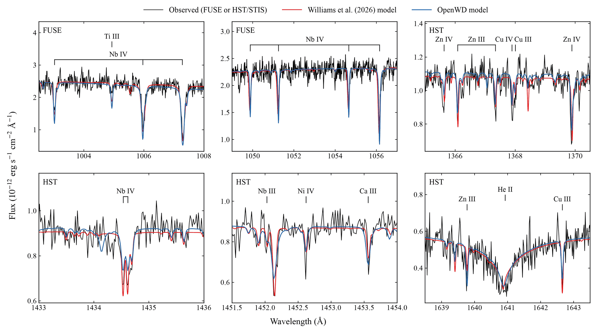
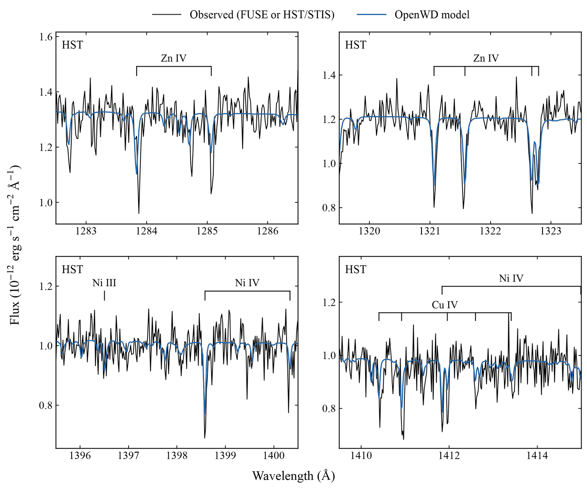
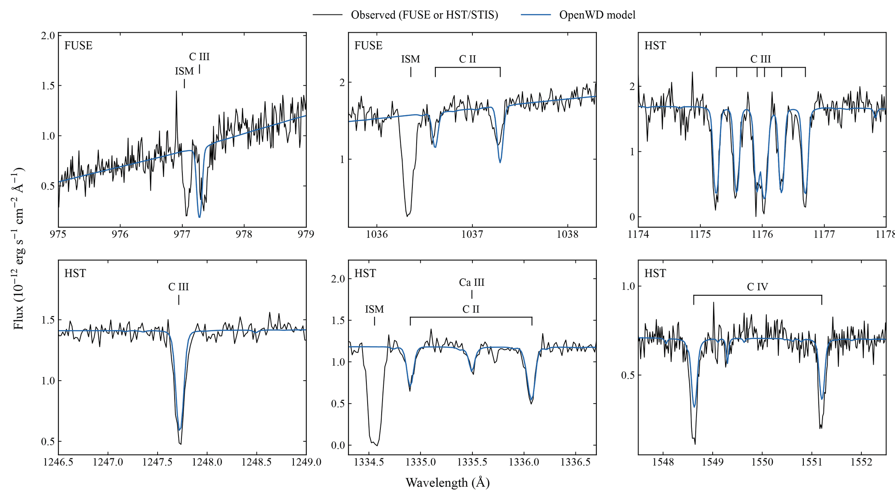

# Niobium, zinc, copper and nickel lines: HS 0209+0832

[Development guide](README.md) · [DAB trace metals](../models/DAB.md#trace-metals)

This page describes three additions and their test on HS 0209+0832:

- Niobium (Z = 41) for every LTE metal preset.
- Trace metals in the homogeneous H/He (DAB) preset.
- Optional E1 lines for Zn IV–V, Cu IV–VI and Ni IV–VI, which the bundled
  Stout files do not have.

Williams et al. (2026, [arXiv:2610.07161](https://arxiv.org/abs/2610.07161))
identified Nb III and Nb IV lines in the far-UV spectrum of HS 0209+0832. We
use their parameters and abundances. We do not fit them.

## Niobium

Request `"Nb"` in the abundances, as for a Stout element. Nb has a full Saha
ladder (Nb I–VI), partition functions from the NIST levels, charge donation
and line opacity. The line widths are the ordinary thermal, radiative and
neutral-perturber widths, with optional classical electron-Stark widths.

`read_niobium_atomic_ion` builds the ions from checksum-pinned files in
`data/runtime/cache/metal-opacity/niobium/` (see that README and
`NIOBIUM_ATOMIC_DATA_FILES`):

| Ion | Levels | Lines | Transition probabilities |
| --- | --- | --- | --- |
| Nb I, II | 378, 353 | none | NIST has none |
| Nb III | 188 | 76 | HFR+CPOL gA, Nilsson et al. (2010) Table 7; only log gf > -0.5 |
| Nb IV | 182 | 819 | NIST ASD, mostly Tauheed & Reader (2005); grades B+ to E |
| Nb V, VI | 30, 104 | none | NIST has none |

Wavelengths are vacuum Ritz values from the NIST level energies. The
oscillator strength f follows from A. NIST and Iglesias (1955) give some
strongly mixed Nb III levels different LS names. Thus, we match each Table 7
row by both J values, parity and wavelength. All 76 rows match one level
pair within 0.08 Å. All 5 Nb III and 56 Nb IV lines in the paper have an
atomic match within 0.015 Å.

`IONIZATION_ENERGY_EV` also has the fourth and fifth NIST ionization energies
of Al, Ti, Co, Ni, Cu and Zn. Thus, hot models can use ladders to charge 4.

## Zn, Cu and Ni line supplements

The bundled Stout files for Zn IV–VI, Cu IV–VI and Ni IV–VI contain only
forbidden (M1 and E2) lines. For example, the 10 Zn IV and 23 Cu IV Stout
transitions are all M1. At 35800 K, these stages hold most of each element.
Without E1 lines they add charge and partition functions, but no line
absorption.

`DABConfig(metal_line_supplements=("rauch-zn-cu", "kurucz-fe-ni"))` adds E1
lines (see [DAB trace metals](../models/DAB.md#trace-metals)). The default
`()` uses Stout only. Thus, existing presets do not change.

`"rauch-zn-cu"` adds the HFR lines of Rauch et al. for Zn IV–V (2014) and
Cu IV–VI (2020). See the
[data README](../../src/wd_spectra/data/runtime/cache/metal-opacity/rauch-zn-cu/README.md)
for the files and their terms of use.

- **Zn:** the CDS tables (J/A+A/564/A41) give both level energies. Each level
  matches one Stout level within 1 cm⁻¹. All 400 Zn IV lines attach. For
  Zn V, 1651 of 1879 lines attach; the other lines go to 10 theoretical
  levels that Stout does not have.
- **Cu:** the data are only in the GAVO TOSS service. Its level-energy
  columns do not agree with their rows (399 of 400 Zn IV rows disagree with
  CDS). Its wavelengths, J values, parities, log gf and gA are correct.
  Thus, we attach each Cu line to the one Stout level pair with the correct
  parities and J values whose Ritz wavenumber is within 0.6 cm⁻¹. Lines with
  no pair, or with two or more pairs, are rejected. Attached: Cu IV
  7576/8785, Cu V 4218/5456, Cu VI 2717/3797. On the Zn tables, this
  wavelength method gives the same pairs as the energy method.
- No levels are added. Thus, level labels, partition functions and
  label-based widths do not change.

`"kurucz-fe-ni"` adds Kurucz measured-level lines of Fe IV, Fe VII and
Ni IV–VI from the bundled `data/hot_daz/kurucz/` files. Kurucz names each
file by element and charge, so `gf2803` is Ni IV. It contains Ni IV
1452.220 Å (3d⁶(³H)4s ⁴H₁₃/₂ – 4p ⁴I₁₅/₂, log gf = +0.696) between two
Stout levels.

- The existing missing-transition mode of
  `read_kurucz_gf100_atomic_database` merges the lines. It keeps all Stout
  lines and adds only lines between level pairs that Stout does not connect.
- Kurucz levels that Stout does not have are added (31, 20 and 140 for
  Ni IV–VI). At 35800 K, they increase the Ni VI partition function by 1.4%.
- Fe V, Fe VI and Ni VII are excluded. Some of their Kurucz energies differ
  from Stout by 0.5–3 cm⁻¹, so the 0.1 cm⁻¹ match fails and levels enter
  twice. For Ni VII this doubles the partition function. A guard stops the
  merge if an added level is within 5 cm⁻¹ of a Stout level of equal weight.

## HS 0209+0832 model

The host is the [DAB preset with trace metals](../models/DAB.md#trace-metals):
Teff = 35800 K, log g = 7.90, log H/He = 1.90 and the nine abundances of the
paper (C, Al, Si, Ca, Ti, Ni, Cu, Zn and Nb, with log Nb/H = -6.33). Ladders
go to charge 4 (Nb to charge 5). Metal lines use classical electron-Stark
widths.

Standard quality, one Apple-silicon process, compiled backend:

| Model | Wall time | Peak memory | Certificate | Flux / σT⁴ (100 Å–100 µm) |
| --- | --- | --- | --- | --- |
| Paper metals, Stout lines (post-rebase) | 335 s | 1946 MiB | all 5 gates | 1.00018 |
| Paper metals, with supplements (post-rebase) | 285 s | 1981 MiB | all 5 gates | 1.00009 |
| Metal-free control | 204 s | 1.5 GB | all 5 gates | – |
| All metals at log N/H = -20 | 311 s | 1.9 GB | all 5 gates | – |

The two paper-metal timings are fresh cold starts on numerical commit
`9028e4d`, rebased onto `39664f1`. The two control timings are earlier
pre-rebase measurements. The runs were not isolated timing experiments;
these values do not establish a speedup from adding line supplements.
The default 900–30000 Å spectrum contains about 0.870 of σTeff⁴ for this
hot star. The flux ratios in the table use the separate 100 Å–100 µm
integration, not the finite default output range.

- With all metals at -20, the model reproduces the metal-free preset:
  |ΔT/T| < 7 × 10⁻⁴ on column mass below the top layer (0.18% at the top
  layer) and 0.14% in the emergent flux.
- The paper metals change the temperature by less than 0.2% for
  τ_R = 10⁻⁴–1, by up to 1% for τ_R > 1 and by up to 12% in the outermost
  layers (τ_R < 10⁻⁴).
- The supplements change the temperature by less than 0.3% for τ_R ≤ 100.
- Nb is mostly Nb IV (54–84%), with Nb V (12–57%) and Nb III (0.4–4%) in
  the photosphere. Ni, Cu and Zn are 78–90% stage IV for τ_R = 0.1–1.
- Each line window takes about 3 s to synthesize on the fixed structure.
  Reading the supplements takes less than 0.5 s.

## Comparison with the observed spectrum

The data are the HST/STIS E140M HASP coadd (program 7473) and the CalFUSE
spectrum C0260201. The model is scaled by (R/d)² with the paper's
R = 0.0145 R☉ and d = 82.6 pc, without reddening. It is convolved with the
STScI E140M line-spread function, or with a Gaussian (R = 20000) for FUSE.
Then it is multiplied by one constant per panel, fitted to the observed
continuum. The constants are 0.98–1.02 for STIS and 0.98–1.10 for FUSE.

Red curves are the published model of the paper's Figure 1, recovered from
the vector graphics of the PDF by `research/extract_williams2026_figure1.py`.
They are comparison material attributed to Williams et al. (2026), not
OpenWD predictions or an independently distributed author model grid.
Redistribution terms for those curves and the new external atomic tables
need maintainer review before merge or release; OpenWD's BSD licence does
not relicense them.







χ² per pixel at 82.8 km/s (STIS) and 79.5 km/s (FUSE), with the continuum
scale above. All three models use the same Nb abundance and differ only in
the line lists; "no Nb" removes Nb from the synthesis only.

| Window | Stout lines | With supplements | With supplements, no Nb | Pixels |
| --- | --- | --- | --- | --- |
| FUSE 1002.5–1008 Å | 1.46 | 1.49 | 7.66 | 423 |
| FUSE 1049–1057 Å | 1.38 | 1.35 | 3.01 | 615 |
| STIS 1365–1370.5 Å | 3.31 | 1.73 | 1.82 | 295 |
| STIS 1433–1436 Å | 1.34 | 1.31 | 2.79 | 161 |
| STIS 1451.5–1454 Å | 1.68 | 1.46 | 1.49 | 135 |
| STIS 1638.5–1643.5 Å | 1.33 | 1.33 | 1.36 | 268 |
| STIS 1282.5–1286.5 Å | 2.38 | 1.80 | 1.80 | 214 |
| STIS 1319.5–1323.5 Å | 5.63 | 1.88 | 1.89 | 215 |
| STIS 1395.5–1400.5 Å | 1.75 | 1.22 | 1.22 | 269 |
| STIS 1409.5–1415 Å | 2.91 | 1.84 | 1.84 | 295 |

These values use the pipeline errors only. They ignore pixel covariance and
lines that are still missing. Thus, they compare models; they do not measure
goodness of fit. The carbon windows contain unmodelled interstellar C II
(χ² of 29 and 160); there, the photospheric C II and C III lines fit at
the paper's carbon abundance, and C IV is weaker than observed.

Results:

- Nb reproduces the Nb IV 1434.14/1434.22 Å doublet and the FUSE Nb IV
  lines. On LiF1A alone, five of seven FUSE Nb IV equivalent widths agree
  with the model within 2σ. The model is too strong for 1002.76 Å (40 mÅ
  against 20 ± 7 mÅ; LiF2B gives 38 ± 9 mÅ) and for 1005.70 Å (83 mÅ against
  57 ± 6 mÅ).
- The supplements add the Zn IV 1365.25 and 1369.51 Å, Cu IV 1367.52 Å and
  Ni IV 1452.22 Å lines of Figure 1. Their model equivalent widths are near
  those of the published model. Both models are weaker than the observed
  Ni IV 1452.22 Å line.
- The published model has a line near 1368.1 Å (rest frame) that OpenWD
  does not have.

### Velocity

The STIS data prefer 82.8 km/s, not the 76–78 km/s of the paper's Table 3
(76.8 km/s is the mean for Ca, Ti, Ni, Cu and Zn):

- A joint fit over ten clean STIS windows gives 82.75 km/s. Single windows
  give 80.5–89.8 km/s.
- The coadd uses the paper's wavelength frame: the centroids of ten
  interstellar lines agree with its Extended Data Table 4 within 0.6 km/s.
- Direct centroids of ten photospheric lines give a median of 82.4 km/s.
- The lines of the published Figure 1 model are at 83–86 km/s.

This comparison finds an approximately 6 km/s offset from the reported
Table 3 velocities. We do not know its cause. The adopted 82.8 km/s is a
diagnostic alignment for these figures, not an independent correction to
the paper's systemic velocity.

## Reproduce

`RAW` holds the HST/STIS E140M HASP coadd and x1d files (program 7473), the
CalFUSE `all` file of C0260201 and the STScI E140M line-spread functions.
`CURVES.npz` is optional; `research/extract_williams2026_figure1.py`
(PyMuPDF) makes it from the paper PDF.

```bash
python research/hs0209_niobium.py model --output results/hs0209-niobium/standard
python research/hs0209_niobium.py model --line-supplements rauch-zn-cu kurucz-fe-ni \
    --output results/hs0209-niobium/supplemented
python research/hs0209_niobium.py model --control metal-free --output results/hs0209-niobium/control-metal-free
python research/hs0209_niobium.py model --control negligible-metals --output results/hs0209-niobium/control-negligible-metals
for MODEL in standard supplemented; do
  python research/hs0209_niobium.py windows --output results/hs0209-niobium/$MODEL
  python research/hs0209_niobium.py windows --window-set extended --output results/hs0209-niobium/$MODEL
  python research/hs0209_niobium.py flux --output results/hs0209-niobium/$MODEL
done
for SET in figure1 metals carbon; do
  python research/plot_hs0209_regions.py --model results/hs0209-niobium/supplemented \
      --compare-model results/hs0209-niobium/standard --raw RAW --paper-model CURVES.npz \
      --window-set $SET --stis-velocity 82.8 \
      --output results/hs0209-niobium/figures/hs0209_${SET}_v82p8_kms
done
```

`windows` and `flux` reuse the line supplements recorded in `run.json`.
`plot_hs0209_regions.py` writes the χ² values and continuum scales to a JSON
file beside each figure. `--compare-model` adds the Stout-line model as a
dashed line; the figures above omit it. `research/plot_hs0209_niobium.py`
makes the earlier figure without continuum scaling, at 76.8 km/s.

## Limitations

- No Nb photoionization data are bundled (Verner's fits stop at Zn). The
  thresholds of the populated Nb ions are below 500 Å, so the far-UV
  continuum does not change. The model metadata lists the omission.
- Nb III has only its stronger lines (log gf > -0.5). Nb II and Nb V have no
  lines. Thus, cool stars, where Nb II dominates, show no Nb lines yet.
- All lines use LTE populations. There is no NLTE atom for Nb, Zn, Cu or Ni.
- Rauch lines that go to theoretical levels, and all Cu VII lines, are not
  included. Rauch lines have no damping data and use classical widths;
  Kurucz lines use Kurucz widths.
- To make a supplement a preset default is a physics change. It needs new
  frozen controls and maintainer approval.
