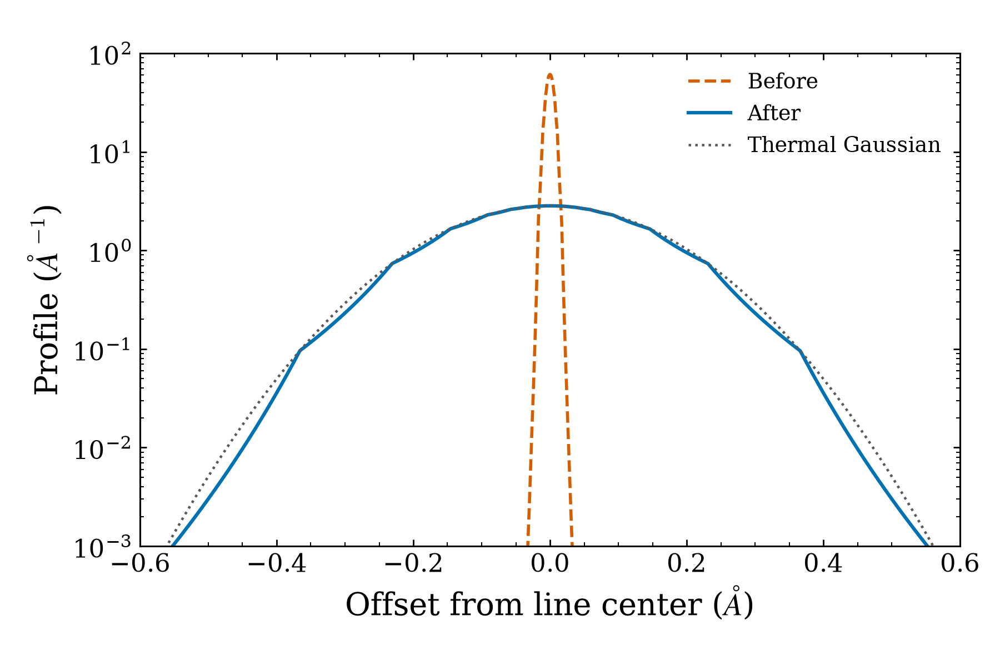
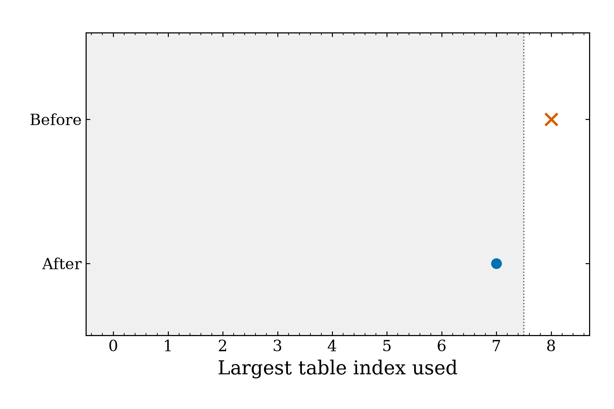
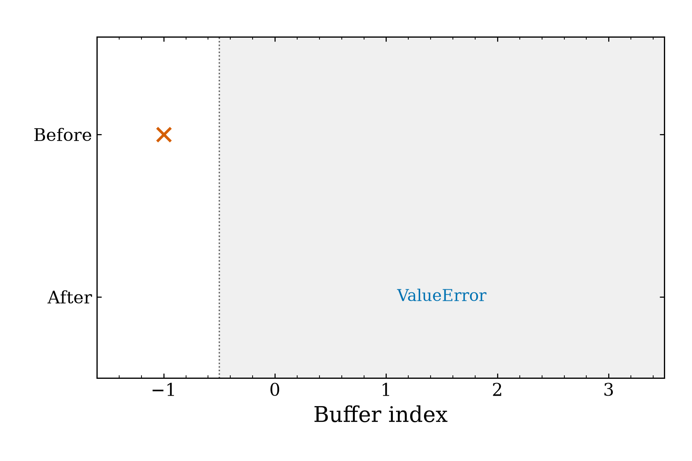
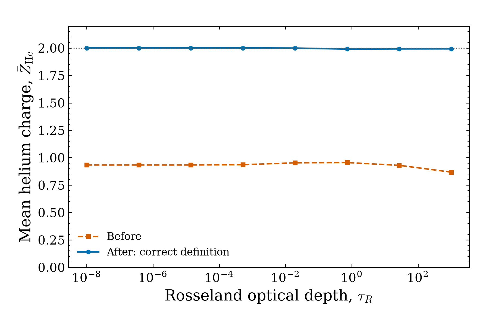
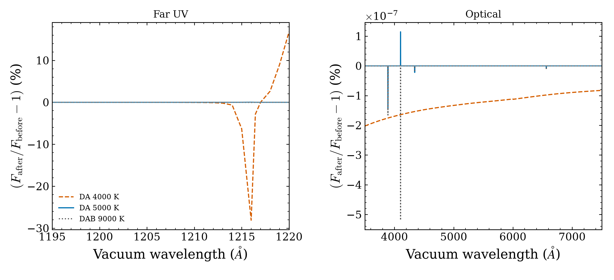

# Hydrogen line widths, native array bounds, and helium mean charge

This patch fixes artificial hydrogen-line narrowing, two unsafe array reads,
and an incorrect stored helium charge. The errors were reproduced on commit
`a1bf936422db8005b3c0e87dc38150d6a4f32549`. The figures show deterministic
calculations. Each panel has its own legend or before/after labels.

## Figure 1: hydrogen density boundary



Local Hα profile at 5000 K and electron density 10⁸ cm⁻³. The blue curve keeps the full profile at the lower density limit. The dotted curve shows a thermal Gaussian. The table interpolation remains an approximation. The fix prevents density scaling from artificially shrinking a profile that already includes thermal broadening.

## Figure 2: native Stark endpoint



An eight-point, nonuniform test grid is queried at its last point. The original code reads index 8, outside the shaded valid range. The fix uses index 7 and returns the expected value, 0.001. Bundled grids are uniform. Keeping reads inside the array prevents incorrect results and program crashes.

## Figure 3: invalid native line center



An invalid (`NaN`) line center makes the original code read index −1, before the buffer. The fix raises `ValueError` before interpolation. The shading marks the first valid indices of the 50-element buffer. Rejecting invalid input prevents unsafe memory reads.

## Figure 4: stored helium mean charge



For He/C/O mass fractions of 0.33/0.50/0.17, the stored mean-charge error falls from 56.4% to zero. Electron and ion populations stay unchanged. PG1159 later recalculates this quantity. Using the current helium count makes the reported average charge consistent with the current mixture.

## Figure 5: spectrum changes from the density repair



Initial spectrum changes for DA 4000 K, DA 5000 K, and DAB 9000 K against the previous references. Atmospheric structures are held fixed. The panels use different vertical scales. Optical relative changes stay below 5.2 × 10⁻⁹. The approved versioned references now pass all 21 fixed-spectrum checks. The density fix removes artificial line narrowing even where its effect on the optical spectrum is small.

## Validation status

### Approved reference update — 2026-10-05

The user approved separate, versioned corrected references for the three
density-edge cases. Their [reference record](../../tests/data/approved_regressions/stark_density_floor_2026_10_05/README.md)
documents the physical correction and provenance. Previous fixed controls,
historical atmospheres, cold controls, and every tolerance are preserved.
The updated local checks passed: 1575 ordinary component tests (1 skipped,
44 deselected), 226 cool-component tests (8 skipped), and all 21 fixed-spectrum
cases. Both official reports confirm unchanged inputs during their runs.
A genuine 4000 K production cold-start canary also passed against the unchanged
cold controls and independent physical gates. Full 25-case cold-start
qualification is pending. A repository maintainer must add the
`full-validation` PR label to request the protected qualification workflow.

### Initial comparison against previous references

Checks run on 2026-10-05 gave the results below. Three fixed-atmosphere spectrum
checks fail. Full validation from newly calculated atmospheres remains required
before merge.

- Ordinary component suite: 1574 passed, 1 skipped, 44 deselected.
- Cool-component suite: 226 passed, 8 skipped.
- Final targeted recheck after documentation packaging: 97 passed, 1 skipped because a cached Koester validation spectrum is unavailable.
- New density regression: 19 of 24 cases failed before the repair; all 24 pass after it.
- Fixed-atmosphere spectra: 18 of 21 passed. The failed cases are `da-4000`, `da-5000`, and `dab-9000`.
- The reference spectra and numerical thresholds were not changed.

Independent fixed-structure calculations restored only the original density
scaling. All three then matched the immutable references within the existing
thresholds. This attributes the failures to the density correction. The
repaired default retains the three failed checks.

| Failed case | Pixels failing the threshold / total | Wavelength range (Å) | Maximum optical relative change |
|---|---:|---:|---:|
| DA 4000 K | 19 / 3000 | 1199–1215 | 2.02 × 10⁻⁹ |
| DA 5000 K | 4 / 3000 | 1215–1217 | 1.44 × 10⁻⁹ |
| DAB 9000 K | 7 / 3000 | 938.9–1216.4 | 5.19 × 10⁻⁹ |

Small changes to the optical spectra do not justify relaxing the failed
thresholds. The density policy and changed reference spectra were reviewed
before the user approved the versioned updates above. Full validation remains
required under the [development policy](README.md).

## Reproduce the regression checks

Use an existing environment with the checkout and test dependencies available:

```bash
python -m pytest tests/test_stark_density_floor.py tests/test_native_line_mean_validation.py tests/test_metal_state_charge_consistency.py tests/test_stark_and_opacity.py
python tools/validate.py fast
python tools/validate.py spectra --jobs 2
```

The numerical code is unchanged since the validation results above.
Both native invalid reads were reproduced with AddressSanitizer; the repaired
reproductions finish without those reads. The patch preserves the existing
profile normalization and Allard weights. Full model qualification remains
required under the development policy.
