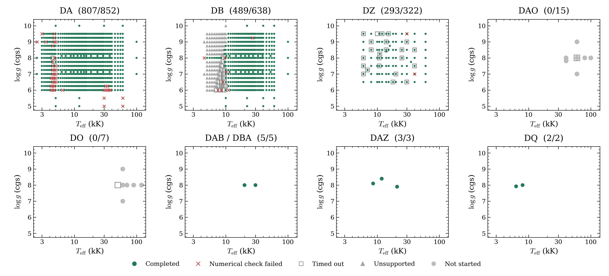

# Initial precomputed grid coverage

We are building initial OpenWD atmosphere grids and tracking where native
models pass the required numerical checks. This is an incomplete development
snapshot, not a completed or physically qualified release grid.



Titles give numerically completed models divided by requested configurations.
Green circles passed the bank's numerical checks; red crosses failed required
checks. Grey squares reached a resource time limit. Grey triangles are currently
unsupported inputs, and grey circles are requests not started. Timeouts remain
unfinished. Multiple compositions can share temperature/gravity coordinates;
blank regions were not requested. Numerical failures include lower-boundary and
temperature-stability checks, not only nonlinear solver stalls.

| Family | Completed | Requested |
|---|---:|---:|
| DA | 807 | 852 |
| DB | 489 | 638 |
| DZ | 293 | 322 |
| DAO | 0 | 15 |
| DO | 0 | 7 |
| DAB/DBA | 5 | 5 |
| DAZ | 3 | 3 |
| DQ | 2 | 2 |

The complete inventory contains 1,848 IDs, including four additional D6, DAH and
PG1159 requests retained in the status table but omitted from this figure. The
saved snapshots are from October 8, 2026, using source
`cfe2d2ff99a434cd502696c1eb7b2f5daf8d11c5`. Newer development tests use a separate
source version and have not been silently added to this historical bank.

## Downloads

A [development-preview release](https://github.com/cheyanneshariat/OpenWD/releases/tag/grid-preview-2026-10-08)
is being prepared in the contributor fork. While the release is a draft, its
assets are visible to users with write access to that fork; publishing makes
the downloads public. It contains 1,599 certified native spectra, separated by
DA, DB, DZ, DAB/DBA, DAZ and DQ, plus full parameter/configuration records,
request tables and checksums. No certified DAO/DO spectra are available yet.
The downloads total approximately 433 MB.

Wavelengths are vacuum Angstrom and fluxes are absolute surface F_lambda in
cgs units per Angstrom, without normalization or wavelength resampling. Native
wavelength grids differ between workflows. Dense-He DB records retain their
experimental-physics labels. Numerical certification does not establish physical
accuracy, atmosphere-depth convergence or full release qualification.

## Reproduce and update

The [compact table](progress.csv) retains original outcomes separately from the
plot categories. Regenerate the plot with the existing NumPy/Matplotlib environment:

```bash
python docs/grids/plot_grid_progress.py --output output/grid-progress
```

For future progress updates, export a new verified status table, retain source and
snapshot identifiers, and regenerate the figure. Do not promote resource-limited
or partially qualified models to completed, or replace the historical run records.
