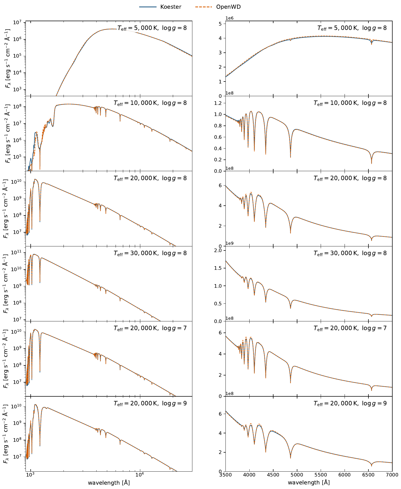
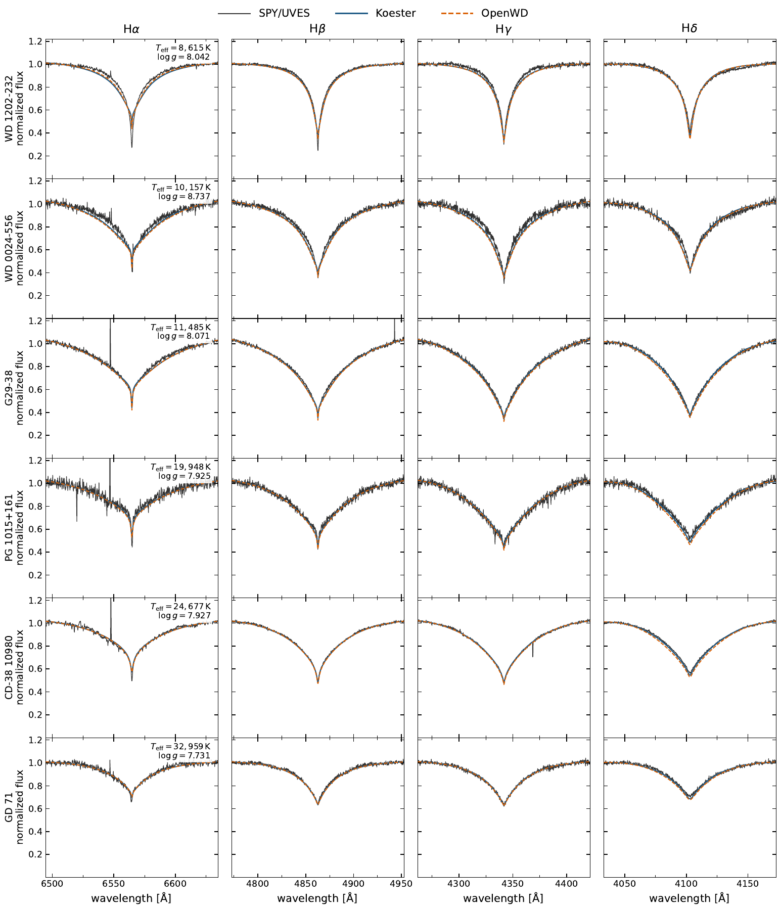

# DA module

[Model guide](README.md) · [Getting started](../getting-started.md)

`compute_da` solves a pure-hydrogen plane-parallel LTE atmosphere in
hydrostatic and radiative/convective equilibrium. It includes Hummer--Mihalas
occupation probabilities, correlated Q-MHD microfields, dissolved-series
opacity, H-/H2/H2+/H3+ chemistry at low temperature, and ML2/alpha=0.7
convection.

Hydrogen bound-bound opacity spans Lyman through Brackett. Charged-particle
profiles use the Tremblay--Bergeron tables. Neutral-H Balmer broadening uses
Ali--Griem below 10,000 K and Barklem at higher temperatures. The validated
Lyman policy uses the fixed TLUSTY/Allard Ly-alpha table at 9000--13,000 K,
temperature-dependent supplied Allard profiles at higher temperature, and the
independent cool neutral-H/H2 wing below 9000 K.

```bash
python examples/one_shot_da.py --teff 12000 --logg 8.0 \
  --quality standard --output results/da-12000-8.0
```

Warm standard models normally take minutes; cool convective production models
can take tens of minutes. `quick` verifies the interface but is not a science
atmosphere. Wavelengths are vacuum Angstrom and output fluxes are surface
`F_lambda`.

Protected cold starts reach 3000 K at log g = 8, with additional checks at
4000, 5000, and 20000 K. See [tested points](../tested-temperature-ranges.md)
and [limitations](../limitations.md) for settings and the scope of that evidence.

## Paper comparisons

The paper tests both the predicted spectral-energy distribution and the
resolved Balmer profiles. The grid comparison uses six fixed parameter pairs:
5000, 10000, 20000 and 30000 K at log g = 8, plus log g = 7 and 9 at
20000 K. Each OpenWD atmosphere is relaxed at its own temperature and gravity
with the pure-H EOS, line profiles and ML2/alpha=0.7 convection described above.
The blue curves are the public Koester DA grid distributed through SVO; they
are comparison spectra, not input atmospheres for OpenWD.

[](../assets/da-paper-grid.pdf)

[Download the grid comparison (PDF)](../assets/da-paper-grid.pdf).
The left panels show the UV--IR distribution and the right panels the optical
spectrum. Both curves are surface `F_lambda`, with no fitted flux scale or
continuum normalization. This tests continuum and line agreement at the
displayed points, rather than certifying every model between them.

The observed comparison holds the parameters from
[Koester et al. (2009)](https://doi.org/10.1051/0004-6361/200912531)
fixed for six SPY/UVES stars, spanning 8615--32959 K. OpenWD calculates an
atmosphere at each parameter pair; the Koester reference is bilinearly
interpolated to the same values. Both predictions are convolved to
`R = 18500` and normalized with the same local sideband procedure as the
observations, since the echelle spectra are not spectrophotometric. Observed
pixels are median-binned to 0.20 Å for display.

[](../assets/da-paper-spy.pdf)

[Download the SPY comparison (PDF)](../assets/da-paper-spy.pdf).
G29-38 and PG 1015+161 contain trace metals, but the displayed broad Balmer
profiles are tested with pure-H models. The close agreement between the two
codes does not remove their shared cool-star line-core residuals: the
one-dimensional LTE and local-convection approximations still matter.
These are the archived paper curves; current synthesis defaults and their
separate regression checks are described below.

## Radiative atmospheres with convection disabled

Set `DAConfig(mixing_length_alpha=None)` to solve a radiative atmosphere.
The solver enforces local heating/cooling balance from its first iteration;
it skips the ML2 gradient conditioner when there is no convective transport.
Its energy solve uses a fresh temperature-response matrix with consistent
equation weights on every step.

For `quality="production"`, the initial 100-layer grid gets up to 40 Newton
iterations. If it fails equilibrium, the code interpolates that numerical
seed onto 200 layers and solves the same equations again. This resolves steep
hydrogen-ionization transitions that can stall the coarser grid. A supplied
finer radiative restart retains its depth resolution. Temperature, gravity,
chemistry, opacity prescriptions, convection and convergence tolerances are
unchanged. The finer atmosphere must pass its own complete equilibrium
certificate; exhausting both attempts still returns an unconverged warning.
The refinement and initial failure diagnostics are recorded in atmosphere
metadata under `radiative_depth_refinement`.

This path also serves the default DAH prescription on a nonmagnetic atmosphere
when the field suppresses convection.
The G 76−48 regression uses 6680 K and log g = 7.96, with molecular chemistry,
zero magnetic field in the structure calculation and convection disabled.

## Spectrum synthesis

`compute_da` uses monotone cubic (PCHIP) source interpolation by default to
reduce coarse-depth-grid flux bias:

```python
import numpy as np
from wd_spectra import DAConfig, compute_da

result = compute_da(
    DAConfig(effective_temperature=12000, logg=8, quality="standard"),
    np.geomspace(100, 1_000_000, 6000),
)
```

This is a cold start. Cubic interpolation changes only the final spectrum calculation:
the atmosphere solver, depth grid, opacities and convection are unchanged.
Scattering is solved consistently with the cubic interpolation, with a
separate source-closure check. There is no fitted flux scaling or imposed
bolometric normalization, and failure does not select another method.
The selected method is recorded in `result.spectrum.metadata`.

On the checked 12000-K, log-g=8 standard model, this reduces the broad sampled
flux deficit from about 2% to about 0.02%, adding roughly 1-2 seconds of
transfer work. It can also change normalized Balmer profiles by about 1-2%
on that 40-layer grid. Wavelength, depth and full-physics validation remain
separate requirements. To explicitly reproduce the former interpolation
method, pass `synthesis_transfer="formal-linear"`; this does not undo physics
corrections in the EOS. Both methods are independently source-checked.
Low-level synthesis routines retain their explicit legacy defaults, including
the directional-intensity interface. Other public models' synthesis defaults
are unchanged.
