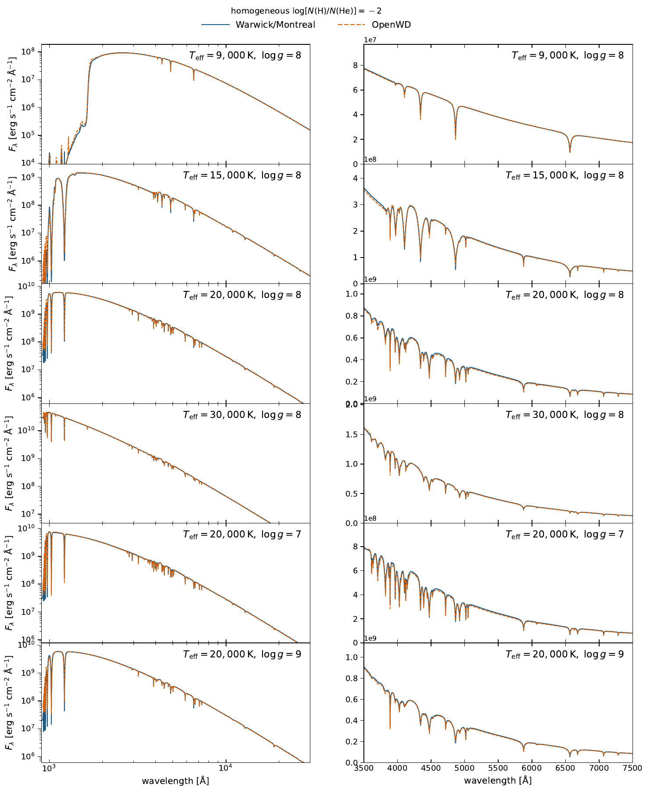

# DAB/DBA module

[Model guide](README.md) · [Getting started](../getting-started.md)

`compute_dab` defaults to one homogeneous atomic H/He layer in LTE; it is not a
stratified thin-hydrogen-layer calculation. Hydrogen and helium share the
charge-neutrality solution and nonideal occupation-probability EOS. The module
combines the DA hydrogen opacity/profile treatment with the DB helium profiles
and uses ML2/alpha=1.25 convection.

```bash
python examples/one_shot_dab.py --teff 20000 --logg 8.0 --log-h-he -2 \
  --quality standard --output results/dab-20000-8.0
```

`--log-h-he` means `log10[N(H)/N(He)]`. Standard calculations typically take
3--20 minutes, with cool mixtures and low-gravity production models slower.

## Paper comparison

The paper fixes `log_hydrogen_to_helium = -2` and compares six homogeneous
H/He atmospheres with the Montreal DB/DBA grid of
[Cukanovaite et al. (2021)](https://doi.org/10.1093/mnras/staa3684).
The temperature sequence is 9000, 15000, 20000 and 30000 K at log g = 8;
two additional models have log g = 7 and 9 at 20000 K. The composition is
one hydrogen nucleus per 100 helium nuclei throughout the atmosphere.

[](../assets/dab-paper-grid.pdf)

[Download the comparison (PDF)](../assets/dab-paper-grid.pdf).
Each OpenWD structure is relaxed with the shared H/He charge-neutrality
solution, the hydrogen and helium opacities, and ML2/alpha=1.25 convection.
Both species therefore affect the temperature structure as well as the
final spectrum. The left panels show 900--30000 Å surface flux and the right
panels show the optical hydrogen and helium features. Neither curve is
rescaled or continuum-normalized for the plot, and the comparison grid does
not provide OpenWD's temperature structure.

This is a fixed-composition comparison between atmosphere codes, not an
observational abundance fit or a test of a stratified H/He layer. The archived
paper spectra and the current molecular cold-start checks below answer
different questions; the six plotted points do not validate cooler mixtures.

## Cool mixtures

Use `run_model(DABConfig(...), output_directory)` for automatic molecular
workflow selection. That workflow includes H2, H2+, H-, H3+, H/He ionization,
H2-He/H2-H2 collision-induced absorption, and neutral Ly-alpha wings. The command-line example uses the same automatic selection as `run_model`.
The lower-level `compute_dab` preset remains an explicit atomic-physics interface.

Fresh molecular calculations have been qualified at 7500, 8000, 9000, and
10000 K for log g = 8 and log10 N(H)/N(He) = -2. These are cold-start points,
not a guaranteed interval; 7250 and 5000 K remain unqualified. Setup requires
production quality, the normal package installation, and additional public data. See
[cool-model setup](../getting-started.md#cool-helium-and-mixed-atmospheres),
[tested points](../tested-temperature-ranges.md), and
[physical limitations](../limitations.md#physical-approximations).

## Flux conservation (2026-10-01)

Two numerics settings are on by default:

- `photospheric_depth_concentration=1` concentrates the structure depths
  across 0.01 < tau < 10 at an unchanged point count.
- `synthesis_transfer_depth_refinement=4` subdivides each depth interval for
  the final formal solution.

Before, the 40-point standard structures emitted up to 2-3% more than
sigma Teff^4. The bare-grid formal solution partly cancelled this, so the
totals looked right while the structure was not. Standard-quality totals
are now within about 0.75% (see the [DZ guide](DZ.md) for the method). Setting
both to 0 and 1 restores the previous numerics.
