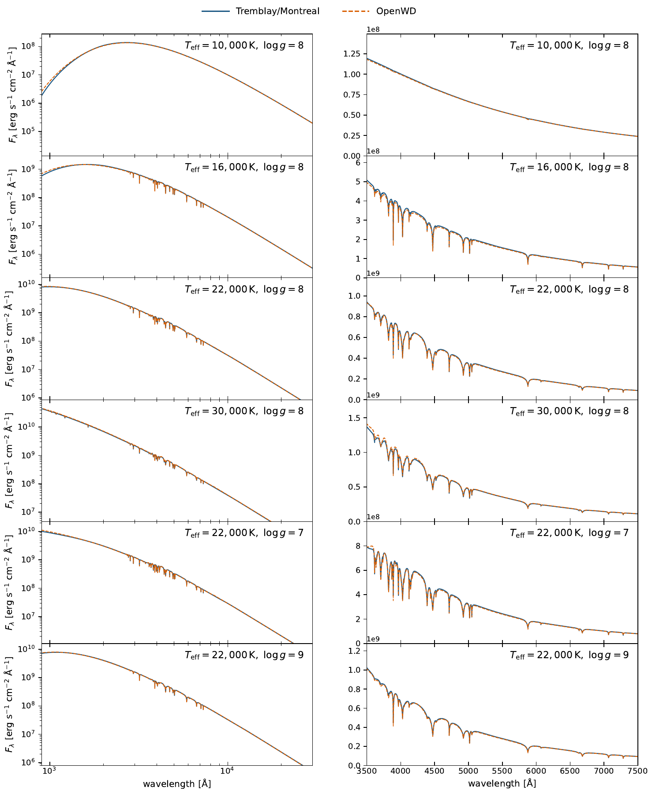
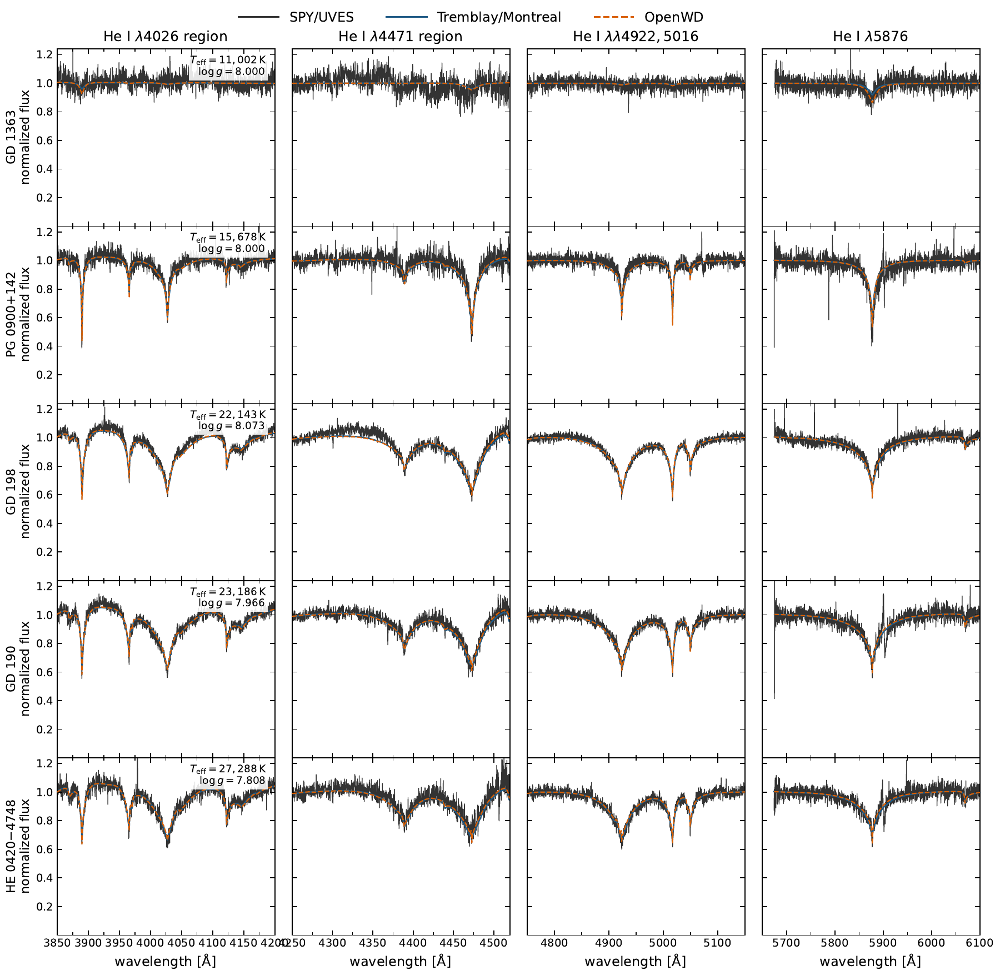

# DB module

[Model guide](README.md) · [Getting started](../getting-started.md)

`compute_db` solves a homogeneous pure-helium LTE atmosphere. It combines a
Hummer--Mihalas/Q-MHD helium EOS, He I/II/III continuum opacity, corrected
Doppler-convolved Beauchamp25-LD He I Stark profiles, Schoening/SYNSPEC He II
profiles, Unsold neutral-He broadening, and ML2/alpha=1.25 convection.

```bash
python examples/one_shot_db.py --teff 20000 --logg 8.0 \
  --quality standard --output results/db-20000-8.0
```

Typical standard calculations take roughly 3--10 minutes on a current laptop;
cool neutral-line models can be slower. No previous atmosphere is needed.

## Paper comparisons

The paper compares pure-He models with the one-dimensional ML2/alpha=1.25
Montreal/Tremblay grid of
[Cukanovaite et al. (2021)](https://doi.org/10.1093/mnras/staa3684).
The six points are 10000, 16000, 22000 and 30000 K at log g = 8, plus log g
= 7 and 9 at 22000 K. OpenWD relaxes its own helium atmosphere at each point
and synthesizes the spectrum using the corrected B25 He I profiles and
neutral-He broadening. The reference grid is used only for comparison.

[](../assets/db-paper-grid.pdf)

[Download the grid comparison (PDF)](../assets/db-paper-grid.pdf).
The left panels cover 900--30000 Å and the right panels show optical helium
lines. The curves retain their absolute surface-flux scale; no continuum
factor is applied to make the displayed spectra agree.

The second figure uses five SPY/UVES DBs at the fixed temperatures and
gravities of [Voss et al. (2007)](https://doi.org/10.1051/0004-6361:20077285),
from 11002 to 27288 K. An OpenWD atmosphere is calculated at each star's
parameters, and the Montreal grid is bilinearly interpolated to the same
point. Both models are convolved to `R = 18500`; data and predictions use
the same local continuum-fitting procedure in the stellar rest frame.

[](../assets/db-paper-spy.pdf)

[Download the SPY comparison (PDF)](../assets/db-paper-spy.pdf).
The sample follows the growth and subsequent weakening of the optical He I
lines. Noise, normalization and line-profile differences remain visible.
These atomic-helium comparisons do not test the cool dense-neutral extension
below, and normalized line agreement does not establish an absolute flux scale.

## Cool helium

Use `run_model(DBConfig(...), output_directory)` to select the experimental
dense-neutral helium treatment when indicated by the local material screen.
It combines the tabulated bulk EOS with approximate chemical potentials and
trace-ion chemistry, without inserting that closure into warm ionized helium.
The command-line example uses the same automatic selection as `run_model`.
The lower-level `compute_db` preset remains an explicit atomic-physics interface.

Protected cold starts cover the established prescription at 10000 and 22000 K
and the dense workflow at 5000 and 8000 K. See [tested points](../tested-temperature-ranges.md),
[cool-model setup](../getting-started.md#cool-helium-and-mixed-atmospheres), and
[physical limitations](../limitations.md#physical-approximations).

## Flux conservation (2026-10-01)

Two numerics settings are on by default:

- `photospheric_depth_concentration=1` concentrates the structure depths
  across 0.01 < tau < 10 at an unchanged point count.
- `synthesis_transfer_depth_refinement=4` subdivides each depth interval for
  the final formal solution.

Before, the 40-point standard structures emitted up to 2-3% more than
sigma Teff^4. The bare-grid formal solution partly cancelled this, so the
totals looked right while the structure was not. Standard-quality totals
are now within about 0.75% (see the [DZ guide](DZ.md) for the method). Setting
both to 0 and 1 restores the previous numerics.
