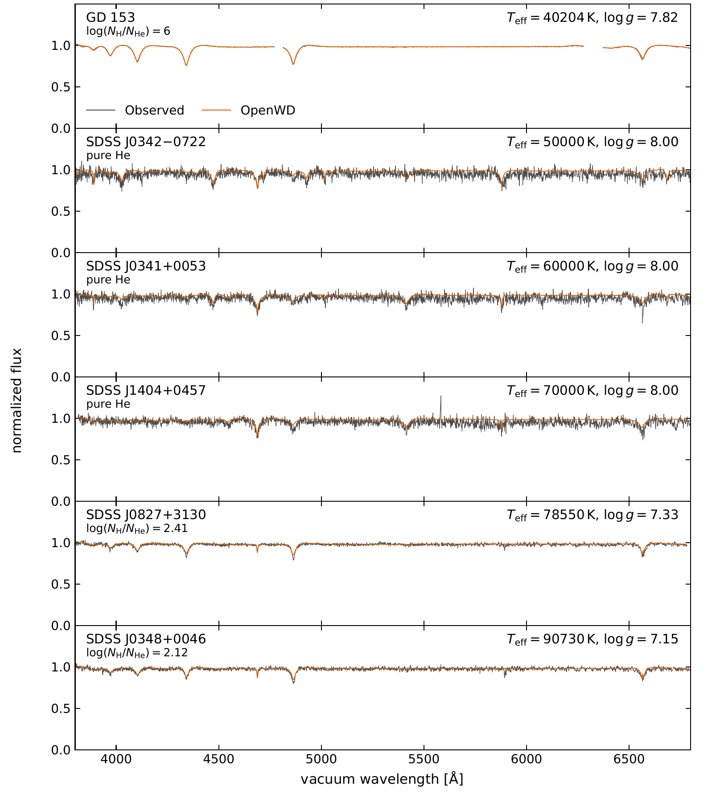
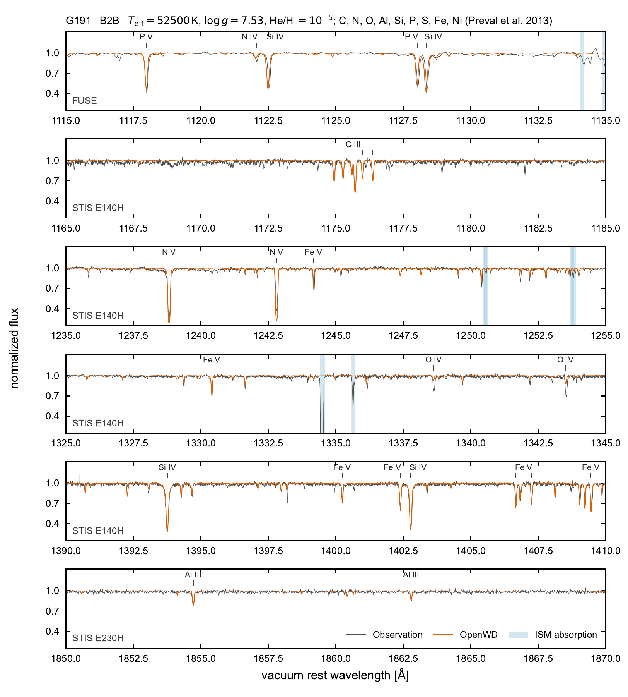

# DO and DAO: hot helium and hydrogen–helium NLTE atmospheres

[Model guide](README.md) · [Development checks](../development/README.md)

`DOConfig` describes pure helium. `DAOConfig` describes homogeneous hydrogen
and helium, with `log_hydrogen_to_helium = log10(N(H)/N(He))`; the default 2
means 100 hydrogen nuclei per helium nucleus. Hydrogen and helium are solved
in NLTE, with an LTE charge/pressure closure. The models are qualified at the
individual tested points, not across a temperature/composition grid.

Select these presets explicitly with `DOConfig` or `DAOConfig`. A high
temperature in `DBConfig`, `DABConfig` or `DAConfig` does not switch that
request to NLTE automatically.

```python
from wd_spectra import DAOConfig, run_model

run_model(
    DAOConfig(effective_temperature=60000, logg=8,
              log_hydrogen_to_helium=2, quality="standard"),
    "results/dao-60000",
    require_convergence=True,
)
```

For pure helium use `DOConfig` and `compute_do`; the mixed counterpart is
`compute_dao`. Both return `ModelResult`, including the population state.
`save_model_result` writes the spectrum, atmosphere, metadata and diagnostic
`populations.npz`. Public runs start from a newly constructed continuum atmosphere and a fresh
shared-solver LTE initialization. They do not take a saved atmosphere. `quick`
skips the LTE initialization and attempts two coupled Newton iterations; it is
a smoke check, not a production equilibrium calculation.

## Paper comparison

The paper's six-panel figure combines three SDSS DOs, two SDSS DAOs and
the CALSPEC hot DA standard GD 153. The DO points are illustrative fixed
models for stars from [Hügelmeyer et al. (2005)](https://doi.org/10.1051/0004-6361:20053280).
The two DAO parameter sets come from
[Tremblay et al. (2011)](https://doi.org/10.1088/0004-637X/730/2/128),
and GD 153 uses [Bohlin et al. (2020)](https://doi.org/10.3847/1538-3881/ab94b4).

| Object | Configuration | Teff (K) | log g | log10 N(H)/N(He) |
| --- | --- | ---: | ---: | ---: |
| GD 153 | DAO, near-pure-H limit | 40204 | 7.82 | 6.00 |
| SDSS J0342-0722 | DO | 50000 | 8.00 | Pure He |
| SDSS J0341+0053 | DO | 60000 | 8.00 | Pure He |
| SDSS J1404+0457 | DO | 70000 | 8.00 | Pure He |
| SDSS J0827+3130 | DAO | 78550 | 7.33 | 2.41 |
| SDSS J0348+0046 | DAO | 90730 | 7.15 | 2.12 |

[](../assets/do-dao-paper.pdf)

[Download the comparison (PDF)](../assets/do-dao-paper.pdf).
Every atmosphere was calculated from a fresh LTE initialization followed by
continuation to the full restricted-NLTE equations. Temperature and H/He
populations are solved together; the charge and pressure closure remains LTE.
The DOs and SDSS DAOs use 40 depths and three angles. GD 153 uses 80 depths,
four angles and eight He II shells; its solid and dashed predictions retain
eight and 20 H I levels, respectively. Only the final equations determine
whether a model passes the convergence checks.

Observations are SDSS spectra except for GD 153 (HST/STIS). Models are
convolved with the wavelength-dependent instrument resolution and shifted
by fixed comparison velocities. Data retain their observed vacuum frame;
missing or masked pixels remain gaps. Data and predictions are independently
pseudo-continuum normalized with the same procedure, so the figure tests
line profiles rather than an absolute spectral-energy distribution.

No temperatures, gravities or abundances were fitted to these spectra.
The DAO literature parameters were derived using models with CNO opacity;
these calculations contain H and He only. Visible line-core residuals and
the LTE charge closure therefore remain physical limitations even when a
cold start converges. The older diagnostic comparison set and its numerical
scores are retained under [observational checks](#observational-checks-and-remaining-limitations).

## Trace metals in hot DA/DAO atmospheres (experimental)

`wd_spectra.hot_trace_metals.solve_hot_trace_metals` adds NLTE trace metals to
a converged DA/DAO atmosphere. The H/He atmosphere is held fixed: its
temperatures, densities, electron densities and H/He populations are not
changed, and the metals do not feed back into the energy balance. The metal
statistical-equilibrium populations are iterated together with a radiation
field that includes the host opacity and the metal line and continuum opacity.
This is a research capability, not a qualified public preset.

### G191-B2B comparison

[](../assets/g191b2b-trace-metals-paper.pdf)

[Download the comparison (PDF)](../assets/g191b2b-trace-metals-paper.pdf).
The H/He atmosphere (T_eff = 52,500 K, log g = 7.53, N(He)/N(H) = 1e-5) is a
public DAO cold start at production resolution (80 depths, four angles). C, N,
O, Al, Si, P, S, Fe and Ni are then solved in NLTE on that fixed atmosphere,
also starting from LTE populations, at the abundances of
[Preval et al. (2013)](https://doi.org/10.1093/mnras/stt1604). No parameter is
fitted. The model reproduces the P V, Si IV, C III and Al III lines and the
Fe V forest; O IV is too weak and the N V doublet too strong.

How the model and figure were made:

* **Model atoms.** C, N, O, Al, Si, P and S keep the lowest Stout levels of
  consecutive ions from the doubly ionized stage upward, with the highest stage
  represented by its ground level. Fe and Ni IV–VII keep all bound levels, with
  the Fe/Ni VIII ground on top (3804 explicit levels). Fe/Ni UV lines come from
  Kurucz's measured-level lists (gfFUV99); EUV resonance transitions missing
  from them are added from the Kurucz `.pos` files. Fe/Ni lines of lower stages
  keep LTE opacity; higher stages carry none.
* **Rates.** Verner ground-state photoionization, Opacity Project cross
  sections for C III–IV and O IV–VI, hydrogenic cross sections for other
  excited levels, CHIANTI collision strengths for C and O and van Regemorter
  rates otherwise. Recombination missing from the truncated Fe/Ni atoms is
  added from the CHIANTI totals with its detailed-balance inverse.
* **Iteration and convergence.** The first statistical-equilibrium solution
  from LTE is adopted in full; later updates use a line-weighted approximate
  lambda operator and ion-wise Anderson acceleration. The populations are
  converged when the undamped update changes the emergent flux by less than
  3e-3 at every wavelength longward of 900 Å (the figure's model was
  converged to 1e-3).
* **Comparison.** The model is shifted to the photospheric velocity
  (23.8 km/s), convolved with the instrument resolution (R = 20,000 for FUSE,
  144,000 for STIS E140H/E230H) and averaged over the observed pixels. Data
  and model are normalized independently, with the same quadratic envelope fit,
  in each 20 Å panel. Interstellar lines identified in the MAST HLSP line lists
  are shaded. The 1335.7 Å line, listed there as photospheric N III/Ni IV, is
  also shaded: it lies within about 1 km/s of interstellar C II* 1335.71 Å at
  the velocity of the second (Hyades) cloud, and the atomic data contain no
  N III line near this wavelength. The model contains no interstellar
  absorption.

All atomic data and the observations are bundled in
`src/wd_spectra/data/hot_daz` with checksums and provenance. To reproduce the
model and figure:

```bash
python research/hot_daz_g191b2b.py --quality production --tolerance 1e-3 --output g191b2b-80
python research/plot_g191b2b_validation.py --model g191b2b-80 --output g191b2b.pdf
```

The production cold start is expensive on one thread: 5.3 h for the H/He host
and 4.8 h for the metals at the 1e-3 tolerance used for the figure (the run
would have stopped after about 3.1 h at the default 3e-3). The 40-depth version
(`--quality standard`) is the canary test
`tests/test_hot_daz_g191b2b_canary.py` (2.7 h on one thread: 1.9 h for the
host and 50 min, 13 iterations, for the metals); it compares the comparison
windows and seven line equivalent widths with a stored reference at the 1% level. The fixed host is the main physical
limitation: adding the metal opacity without relaxing the temperatures leaves
flux errors of up to 14%, and an exploratory relaxation changes the C III,
Al III and S IV equivalent widths by 19–28%. Radiative levitation and
stratification, other observed species (e.g. Ge) and accurate collision rates
for most ions are not included. The development record, convergence studies
and numerical choices are in
[hot DA/DAO trace metals](../development/hot-daz-trace-metals.md).

## Solver and retained atom

Logarithmic temperatures and independent elemental population ratios are
solved simultaneously on a hydrostatic column-mass grid. The common
`solve_trust_region_newton` implementation owns trust bounds, trial acceptance
and termination. The adapter supplies the coupled statistical-equilibrium,
cell-energy and lower-boundary flux equations and their nonlocal transfer
response. It refreshes the coupled Jacobian without Broyden updates.

Nonphysical statistical-equilibrium populations in a proposed trial cause
the common solver to backtrack. An invalid initial or accepted state still
fails, as do unrelated data, input and programming errors.

After two completely rejected Newton directions in the full-NLTE stage,
the adapter enables bounded population restoration on trial steps. For an
optically thin layer with a large temperature correction, it can also propose
a bracketed thermal root, refined through the full transfer equations and
coupled to the neighboring layers. The common solver accepts a proposal only
if it reduces the full residual merit, rebuilds the Jacobian after a material
correction, and requires an ordinary Newton attempt between corrections.
These recovery proposals cannot certify convergence. The final independent
temperature, population, flux, energy, source and boundary checks are unchanged.
`hot_nlte_recovery` records activation and the extra work in atmosphere metadata.
After activation, a changed accepted state gets a fresh tangent before the next
recovery direction; reusing an earlier state's tangent can point uphill even
after its populations have been restored. These extra Jacobians are counted
separately from the common driver's evaluations.

Within each Jacobian, material derivative columns reuse two frozen transfer
responses, to source and relative-extinction changes. A new Jacobian constructs
a new operator. Temporary temperature-profile caches are released after
their derivatives are collected, and continuum sums process wavelengths in
batches to limit temporary storage. These optimizations retain the original
equations, wavelength/depth grids and convergence thresholds. Combining the
cached transfer responses changes floating-point operation order in the
Jacobian: a full 40-layer comparison preserved the residual bit-for-bit and
changed Jacobian entries by at most 1.16e-13.

Planck-to-NLTE continuation initializes the full equations. Only its final,
fully NLTE stage can receive an atmosphere certificate.
`population_maximum_iterations` caps coupled iterations per stage, also
bounded by the selected quality budget. Mixed models start with a deeper
column-mass grid to screen the thermal lower boundary.

The atom retains the research implementation's 14 He I terms, configurable
He II shells (32 by default) and He III continuum, with optional hydrogen
(8 levels plus H II by default; up to 20 explicit H levels may be selected
for atom-resolution checks). Each element has its own conservation row.
Hydrogen and helium now see the same radiation field, including overlapping
opacity, and share one Thomson-scattering contribution. Electron scattering
is solved directly by the release's column-mass Feautrier solver. The energy
residual uses absorption times mean intensity minus emissivity; it does not
replace NLTE emissivity with a Planck source.

The transfer equations use emissivity directly and permit signed net
absorption from stimulated emission where total extinction stays positive.
They do not divide by net absorption inside the atmosphere, clip negative
terms, or accept a nonfinite/negative radiation field. The thermal bottom
condition still requires positive absorption. Where gain is present, lower
boundary screening measures its contribution through the actual coupled
transfer operator; an absorption-only escape estimate would not suffice.

The legacy collision prescriptions and high-level closures are retained:
TLUSTY He I fits, hydrogen CCC rates, TLUSTY/Mihalas hydrogenic rates for He II and the
existing high-shell extrapolations. Explicit line-rate transfer covers the
existing He I components, He II lower shells 1–3 plus every retained optical Pickering transition,
and H lower shells 1–4 within the retained profile tables (including Brackett
upper shells through 14);
other rate transitions retain the atom's Planck-field closure. The existing
population-inversion prescriptions remain in effect. DO/DAO explicitly select
`Tremblay26.txt` for He I and `series-adaptive` interpolation for He II, matching
the legacy hot-DO benchmark. These choices are recorded in the configuration;
they do not change the profile defaults of the other model families.

The retained CCC reader cutoff is n=8, including for optional larger H atoms;
above it hydrogen uses the existing TLUSTY/Mihalas prescription. Shell-9 CCC
data are available, but enabling them would change the physical rates and
requires separate validation. `ccc_maximum_level` and the collision closures
are recorded in result/population metadata. The default He II prescription is
`tlusty-mihalas`, independently of the loaded CCC cutoff.

The He I collision polynomial is bounded to its Chebyshev coordinate interval
(1,000--50,000 K). Outside it, the effective collision strength is held at the
endpoint while the kinetic and Boltzmann factors use the actual temperature.
Unbounded legacy extrapolation produces negative rates above roughly 100,000 K.
This is an explicit approximate closure, not new high-temperature collision data.

## Limitations and certification

**The electron density and gas-pressure closure remain LTE.** Temperature
changes rebuild the shared H/He occupation-probability EOS, but NLTE
ionization departures do not update its electron density or pressure.
Consequently this is restricted NLTE, not a fully charge-consistent hot-star
atmosphere. Metals, radiative acceleration, winds and convection are absent.
An exploratory DO model is not a DOZ model.

A converged flag requires the population defect and the shared all-depth
flux, local cell energy, unrestricted temperature correction, independent
source closure and lower-boundary screening checks. A small surface-flux
error alone cannot establish convergence. The certificate applies only to
the declared equations and structure grid. Independent depth/wavelength
refinement and comparison with observed stars remain separate requirements.
Unconverged outputs warn; `require_convergence=True` rejects them after saving
diagnostics. No observational range is qualified yet.

## Bundled atomic data

OpenWD installs the required collision and profile inputs under its runtime
data directory:

- `ccc/e-H_XSEC_LS.zip`
- `tlusty-source/tlusty200.f`
- `tlusty-atoms/he1_14lev.dat`

The profiles `helium-stark/Tremblay26.txt` and `helium-stark/he2prf.dat` are
installed there as well. No separate download or `OPENWD_DATA` setting is
needed for a normal package installation.

`ModelData.default(root)` and `OPENWD_DATA` remain available for a complete
custom data tree. All paths then resolve under that selected root; missing
files produce an explicit error and are never replaced or downloaded
implicitly. See `THIRD_PARTY_NOTICES.md` for attribution and redistribution
terms.

## Cold-start qualification and runtime

Seven prescribed public configurations have passed from fresh initialization.
No saved atmosphere, populations or Jacobian was supplied. Internal LTE and
Planck-to-NLTE initialization belongs to that same cold invocation. Stellar
parameters, iteration budgets and convergence thresholds were unchanged.

| Preset | Parameters | Resolution | End-to-end time |
| --- | --- | --- | ---: |
| DO standard | 50,000 K, log g=8 | 40 layers, He II 32, 3 angles | 83.90 min |
| DO standard | 60,000 K, log g=8 | 40 layers, He II 32, 3 angles | 57.61 min |
| DO standard | 70,000 K, log g=8 | 40 layers, He II 32, 3 angles | 140.97 min |
| DAO standard | 60,000 K, log g=8, log H/He=2 | 40 layers, He II 32, H8, 3 angles | 282.92 min |
| GD153 standard | 40,204 K, log g=7.82, log H/He=6 | 40 layers, He II 32, H8, 3 angles | 167.06 min |
| GD153 production | Same parameters | 80 layers, He II 8, H8, 4 angles | 124.19 min |
| GD153 production | Same parameters | 80 layers, He II 8, H20, 4 angles | 187.11 min |

These are individual instrumented measurements with concurrent workloads,
not controlled timing comparisons. A standard full Jacobian used about
7.3 GB peak process memory in the response-cache benchmark; larger atoms and
grids need more. Start with one calculation and one BLAS/OpenMP thread.

The original seven-point matrix above was accumulated across solver revisions,
with source hashes retained per invocation. Its DO50 run used the installed
release wheel and fresh-tangent recovery. H20 used the preceding
integration; it never activated recovery, so the later recovery-only refinement
was dormant. Other points retain their recorded earlier revisions. This is
not a claim that every point was rerun on one final binary, or a guarantee
throughout a temperature/composition range.

After the transfer-cancellation correction, two further cold runs of the final
scoped source passed: DO50 standard (87.07 min) and GD153 production
H8 (130.88 min), with unchanged parameters and resolution. These timings
also include concurrent workloads. Their [certificates and comparisons](../development/history/do-dao-transfer-cancellation-evidence.json)
are separate from the historical seven-point matrix above.

For details see the [release evidence](../development/history/do-dao-release-2026-09-20.md)
and its [machine-readable measurements](../development/history/do-dao-cold-evidence.json).
The release also includes successful public DO/DAO adapter tests, typed trial
failure/backtracking checks, independent Jacobian checks, and optional slow
cold-start canaries.

```bash
python -m pip install -e '.[test]'
python -m pytest tests/test_helium_nlte.py tests/test_hot_nlte.py tests/test_hot_structure.py
python -m pytest tests/test_hot_public.py tests/test_hot_error_boundary.py tests/test_hot_recovery_*.py tests/test_hot_response.py

# Seven expensive fresh calculations using the installed data.
OPENBLAS_NUM_THREADS=1 OMP_NUM_THREADS=1 \
  python -m pytest -m canary tests/test_hot_cold_canary.py

# Experimental trace metals: 40-depth G191-B2B cold start (about 3 h).
OPENBLAS_NUM_THREADS=1 OMP_NUM_THREADS=1 \
  python -m pytest -m canary tests/test_hot_daz_g191b2b_canary.py
```

The ordinary tests use small synthetic collision fixtures to keep fast CI
bounded, while package tests verify that the complete inputs are installed.
The slow cold-start canaries use the bundled physical data and remain excluded
from fast CI. An explicitly selected but incomplete custom data root fails
them. The canaries must not be reported as passed when skipped.

For an instrumented public run, including source hashes and per-stage
numerical diagnostics:

```bash
OPENBLAS_NUM_THREADS=1 OMP_NUM_THREADS=1 PYTHONPATH=src \
  python research/run_hot_public_diagnostic.py --data-root /path/to/data \
  --teff 60000 --logg 8 --quality standard --output results/do-public-cold
```

The output must be new. The diagnostic runner writes checkpoints for inspection
but never reads them to initialize a public calculation.

## Observational checks and remaining limitations

The earlier [cold-only six-object comparison](../assets/do-dao-cold-observed.pdf) uses
the same stacked-spectrum style as the DZ/DQ paper figures. The
[full comparison set](../assets/do-dao-cold-variants.pdf) includes all three
GD153 grids. This older selection differs from the paper sample above.
No stellar parameters were fitted. Display normalization differs
from the line-local protocol used for quantitative scores.

At 50,000 K, J034227's observed chi-square is 1.80% lower than legacy.
The 70,000 K model passes both RE 0503-289 and J140409 comparisons. At
60,000 K, J131724 improves but J034101 remains 0.4217% worse than legacy;
its strict no-regression gate fails, mostly in He I 4471. Thus not every
observed target matches legacy at least as well.

GD153's H-alpha normalized RMS is 0.007162 (standard), 0.004937
(production H8), and 0.005138 (production H20), versus 0.002644 for the
separate TMAP pure-H reference. The larger H atom did not improve this score.
These are convergence-qualified calculations, not observational qualification
of the restricted physics.

Public hydrogen controls can be fetched and compared independently:

```bash
python -m pip install -e '.[validation]'
python research/fetch_hot_hydrogen.py --output results/hot-hydrogen-observed
python research/validate_hot_hydrogen.py --data results/hot-hydrogen-observed \
  --star gd153 --model results/gd153 --output results/gd153-observed
```

The inputs are public CALSPEC STIS spectra of GD153 and G191-B2B, with separate
TMAP/TLUSTY reference spectra and their header parameters. G191-B2B includes
metals missing from these restricted H/He models. The GD153 comparison uses
older STIS resolution metadata because the current file's FWHM column is
malformed. Only observed optical segments are scored. Statistical-error
chi-square omits continuum-fitting and flux-calibration covariance. The
legacy DO comparison additionally requires the separate research workspace's
cached observations and reference spectra; those raw data are not redistributed.
