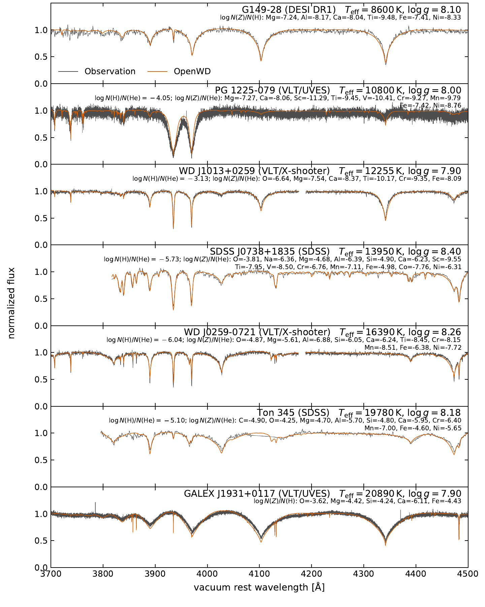
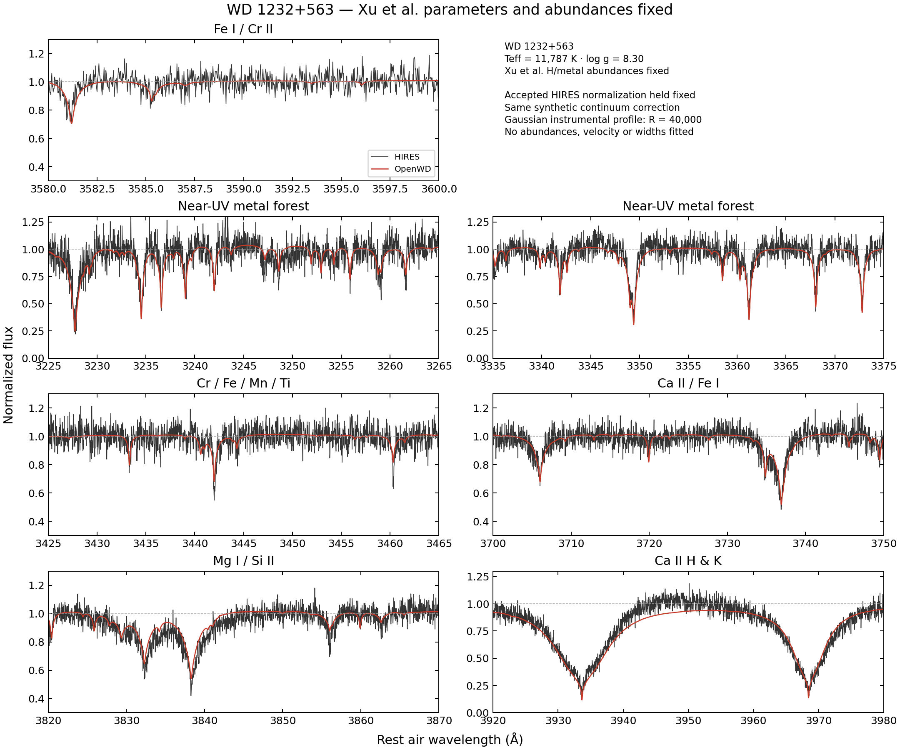
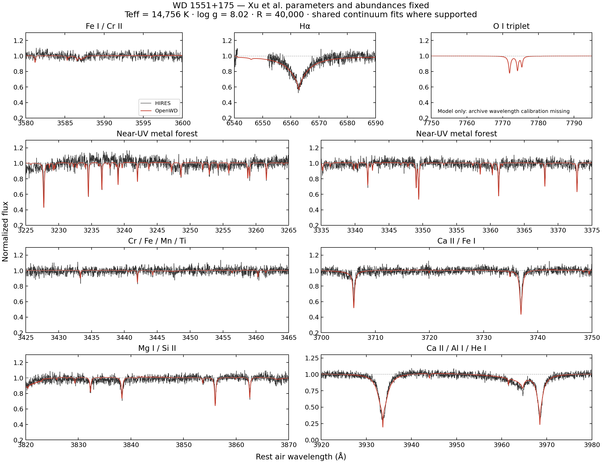
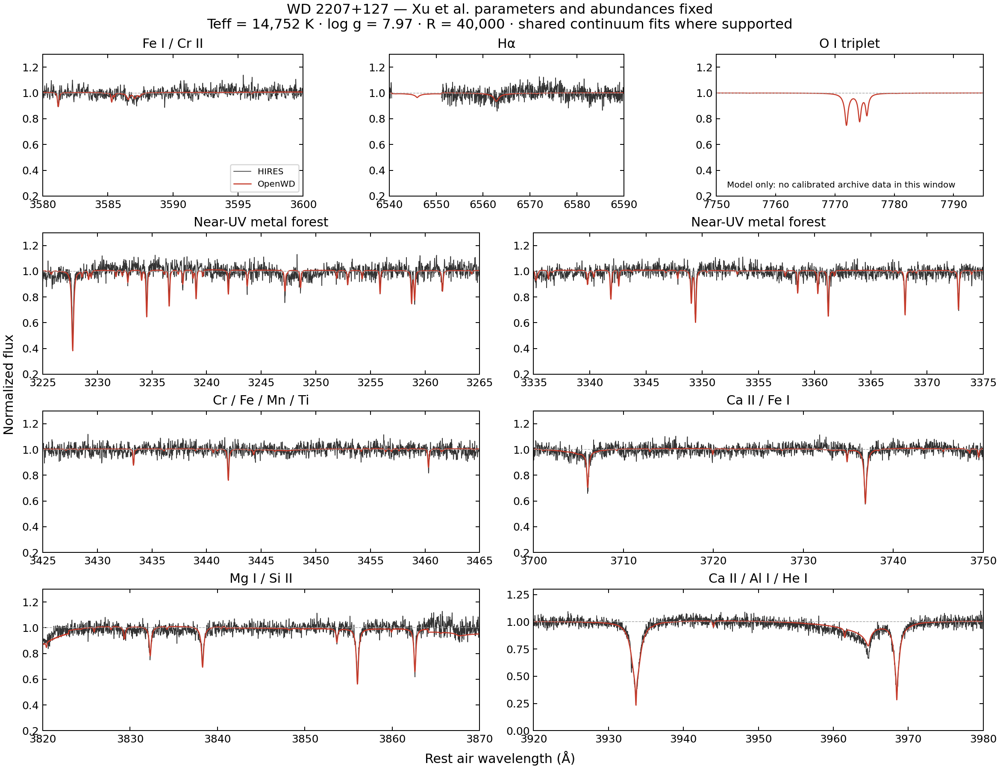

# DZ/DBZ module

[Model guide](README.md) · [Getting started](../getting-started.md)

`compute_dz` solves a helium-dominated polluted LTE atmosphere at fixed input
abundances. Metals contribute electrons, bound-free opacity, sampled line
blanketing, and therefore feed back on the relaxed structure. The default
metal database uses Stout v3.00b4, adding the bundled Kurucz Cr II
missing-transition supplement when chromium is present. The GD 40 preset
includes levels through charge 3, dense-helium ionization shifts, and
available unified Mg I--He and Ca I--He profiles.
Observable helium and trace-hydrogen lines use the same policies as DB and
DAB. Evaluated NIST replacements for matched strong transitions remain
available as the explicit `strong_line_atomic_data="nist-asd"` alternative.
Trace-hydrogen Lyman lines likewise retain the figure's charged-particle
Stark treatment by default; `lyman_profile_source="allard"` explicitly
selects the later unified-profile option.

The metal physics was revised after a 2026-09-30 audit (physics revision
`metal-audit-2026-09-30`):

- Bound-free opacity is level-resolved Opacity-Project photoionization from
  every level of the bundled TLUSTY/SIROCCO model atoms (C I--II, O I--II,
  Mg I--II, Al II, Si I--II, S II, Fe II), including excited-level continua
  such as Mg I 3P and Si I 1D. Identified model terms are placed at their
  observed Stout energies. Other ions keep Verner et al. (1996) fits, which
  are applied to the whole LS ground term rather than its lowest ``J``
  level. `level_resolved_photoionization=False` restores Verner fits only.
- Metal partition functions use Hummer--Mihalas occupation probabilities
  (Q-MHD charged microfields and the neutral-He excluded volume), iterated
  with charge neutrality; the line opacity applies the same level survival.
  `occupation_probability_metal_partitions=False` restores the fixed 0.1-eV
  cutoff.
- The Blouin et al. (2018) dense-He shift enters the Saha equation with the
  full partition functions, so it vanishes in the dilute limit. Outside the
  authors' tested 2000--10000 K and 0--1.5 g cm^-3 range the fit is held at
  its edge instead of being switched off.
- Metal lines use an exact Voigt profile evaluated in frequency (Humlicek
  W4), so impact wings keep their physical asymmetry. Unsold widths use the
  hydrogenic ``<r^2>`` with its ``1/Z^2`` core-charge factor, and levels
  above the first ionization limit are measured from their parent limit.
- Inside the published Ca I--He density range the unified 4227-A profile
  replaces the impact profile; below it, the impact core plus the
  density-scaled non-impact part of the unified profile is used.
- The structure solve computes opacity for exactly the lines its frequency
  grid samples.
- The measured Hammond (1975) Ca II H/K widths in helium are extended in
  temperature with impact theory for his own Lennard-Jones (12,6) fits to
  those widths and shifts. His two-shot exponent, which he advises against
  using, is no longer applied. At 15000 K the width is 1.58 times its
  5200-K value, against 1.27 for the old power law.
- The `strong_line_atomic_data="nist-asd"` option replaces every exactly
  matched Stout transition down to f = 1e-4 with evaluated NIST ASD values
  (accuracy C or better), including 115--300 nm (Mg I 2852, Mg II h/k, Si II,
  C II, Al II, Fe I/II). The default retains Stout oscillator strengths and
  adds missing Cr II transitions from Kurucz.
- Verner's phfit2 fits supply ground-state edges for iron-group ions absent
  from `photo.dat` (Ti, Cr, Mn, Ni, ...). Bautista (1997) Fe I and NORAD Cr I
  level-resolved cross sections are bundled (xz-compressed, checksummed) and
  required; they are used for terms identified with observed levels within
  0.5 eV.
- Ca II H and K use complete-redistribution source functions solved
  exactly with the linear formal Lambda operator. Collisional transfer
  between the two 4p levels feeds the partner line instead of thermalizing
  the photon. Populations and extinction stay LTE.
- Trace hydrogen keeps charged-particle (Q-MHD) level dissolution only. An
  audit variant also applied the HM88 neutral-He hard-sphere term with
  `r_n = n^2 a_0`. That removed almost all n >= 6 population in DBA
  photospheres and erased the observed Hdelta of WD J1013+0259, so it was
  reverted.
- The emitted spectrum is flux conserving (1.000--1.003 of sigma Teff^4 at
  9000--15600 K, against 0.84--0.91 before). Three numerical changes do this:
  - The structure absorbs the synthesis line list (f >= 1e-4, the same
    20,000-line budget), opacity-sampled on a uniform R = 1000 grid
    (`structure_opacity_sampling_resolution`). The former 1000-line
    structure, with line-centered samples, left the extra synthesis
    blanketing unbalanced. Those samples also overweighted narrow cores.
  - The 40 structure depths are concentrated across 0.01 < tau < 10,
    taking points only from the optically thin top
    (`photospheric_depth_concentration=1`).
  - The final formal solution subdivides each depth interval four times
    (`synthesis_transfer_depth_refinement=4`), interpolating opacity
    log-log in column mass. On the bare structure grid the piecewise-linear
    formal solution lost 5--6% of the flux of these steep convective
    atmospheres.

  Together these add about 15--20% to a standard cold start.
  `structure_opacity_sampling_resolution=None`,
  `photospheric_depth_concentration=0` and
  `synthesis_transfer_depth_refinement=1` restore the previous numerics.

```bash
python examples/one_shot_dz.py --teff 15300 --logg 8.0 \
  --abundance O=-5.61 --abundance Mg=-6.24 --abundance Si=-6.76 \
  --abundance Ca=-6.88 --abundance Fe=-6.48 --log-h-he -6.16 \
  --quality standard --output results/gd40
```

Abundances are `log10[N(element)/N(He)]`; supplying any `--abundance` entries
replaces the entire default abundance dictionary. The model does not refit
`Teff`, `log g`, or composition. Standard line-rich atmospheres can take from
about 30 minutes to several hours. `dense_helium_eos="reos3"` is available in
the Python configuration as an explicitly experimental bulk-EOS option; the
validated production default remains the chemical-picture EOS.

The [DZ fitting notebook](../../examples/fit_dz_spectrum.ipynb) fits Ca, Mg and
Fe in four public VLT/UVES spectra of PG 1225-079, with Teff, log g and the
remaining composition held fixed. The observed coadd is included in the
repository. Each trial uses `relax_atmosphere=False` on one certified
cold-start structure. These are diagnostic fits, not a final abundance
solution. See the [fitting notes](../examples/fitting-dz.md) for data
provenance, error assumptions and the structural-feedback check.

Paper-spectrum regression and cold-start convergence are separate checks.
See [tested points](../tested-temperature-ranges.md) and
[reference-comparison limitations](../limitations.md#spectrum-accuracy-and-reference-comparisons)
for the status of PG 1225 and SDSS J0738+1835.

## Paper comparison

The paper compares seven polluted white dwarfs at fixed literature parameters
and abundances. Five have helium-dominated atmospheres and use DZ/DBZ; the
first and last panels are hydrogen-host [DAZ models](DAZ.md#paper-comparison).
The abundance labels in each panel specify the complete adopted mixture and
its H or He denominator.

| Object | Host | Teff (K) | log g | Observation | Parameter source |
| --- | --- | ---: | ---: | --- | --- |
| G149-28 | H | 8600 | 8.10 | DESI DR1 | [Zuckerman et al. (2011)](https://doi.org/10.1088/0004-637X/739/2/101) |
| PG 1225-079 | He | 10800 | 8.00 | VLT/UVES | [Klein et al. (2011)](https://doi.org/10.1088/0004-637X/741/1/64) |
| WD J1013+0259 | He | 12255 | 7.90 | VLT/X-shooter | [Izquierdo et al. (2023)](https://doi.org/10.1093/mnras/stad282) |
| SDSS J0738+1835 | He | 13950 | 8.40 | SDSS | [Dufour et al. (2012)](https://doi.org/10.1088/0004-637X/749/1/6) |
| WD J0259-0721 | He | 16390 | 8.26 | VLT/X-shooter | [Izquierdo et al. (2023)](https://doi.org/10.1093/mnras/stad282) |
| Ton 345 | He | 19780 | 8.18 | SDSS | [Wilson et al. (2015)](https://doi.org/10.1093/mnras/stv1201) |
| GALEX J1931+0117 | H | 20890 | 7.90 | VLT/UVES | [Vennes et al. (2011)](https://doi.org/10.1111/j.1365-2966.2011.18323.x) |

[](../assets/dz-daz-paper.pdf)

[Download the comparison (PDF)](../assets/dz-daz-paper.pdf).
Every plotted atmosphere was relaxed at its displayed composition. Metal
electrons, continuum opacity and line blanketing participate in the structure
calculation; the final synthesis adds the detailed Stout line list. Helium
models use the nonideal He EOS, trace hydrogen where listed, dense-He metal
ionization shifts and ML2/alpha=1.25 convection. The complete-redistribution
Ca II source affects the final line cores while retaining LTE populations.

Predictions are convolved to the corresponding instrumental resolution:
`R = 2000` (DESI), 19540 (PG 1225 UVES), 5453 (X-shooter), and 40970
(GALEX J1931 UVES), or Gaussian FWHM 2.23 and 2.57 Å for J0738 and Ton 345.
Data and models then receive the same independent pseudo-continuum procedure
and are plotted in rest-frame vacuum wavelengths. These display operations
leave the atmospheric parameters and abundances fixed.

The figure tests the metal-line pattern and normalized profiles across very
different mixtures. It does not establish an absolute continuum match or a
uniformly validated abundance grid. In particular, the older plotted J0738
atmosphere and a fresh calculation with the present certificate are distinct
checks; consult the linked tested-point record before treating it as a
qualified cold start.

## Xu et al. (2019) HIRES comparisons

These three comparisons use the helium-dominated stars in Figures 11--13 of
[Xu et al. (2019), AJ, 158, 242](https://doi.org/10.3847/1538-3881/ab4cee).
The black curves are public Keck/HIRES spectra retrieved from the
[Keck Observatory Archive](https://koa.ipac.caltech.edu/); the red curves are
OpenWD predictions at the paper's fixed parameters and detected abundances
(Tables 1 and 4). No atmospheric parameters or abundances were fitted.

The default metal line list now includes the complete Kurucz Cr II
`gf2401.all` missing-transition supplement. It preserves existing Stout
levels, transitions and oscillator strengths, while adding absent transitions
and their Kurucz damping constants. The file is bundled and checksum-verified,
so these examples require no separate line-list download or custom atomic
database. It is used in both atmospheric line blanketing and the final
synthesis, subject to their normal line-selection budgets. See the
[atomic-data provenance](../../src/wd_spectra/data/atomic/README.md).

The plotted spectra were computed with OpenWD commit
[`57f95fc`](https://github.com/kareemelbadry/OpenWD/commit/57f95fc), plus this
same Cr II supplement, using standard-quality relaxed atmospheres and
ML2/alpha = 1.25 convection. They predate the metal-physics audit described
above. The commands below generate new spectra with the current defaults at
the same stellar parameters; they do not exactly reproduce these archived
curves. Their convergence must be checked independently.

For display, the synthetic flux and line-free continuum were convolved to
`R = 40000` and integrated over native detector pixels. Observed orders were
coadded with inverse-variance weights without smoothing. Data and models were
normalized independently with matched local pseudo-continuum masks and
weights, including local fits around Ca II H/K that avoid extrapolating the
continuum. The plots use rest-frame **air** wavelengths; the generated model
files use rest-frame **vacuum** wavelengths. Residual line-depth and Ca/He
core differences remain, so these are comparisons at a literature composition,
not abundance fits or a claim of agreement in the absolute flux.

Run the commands from a source checkout with OpenWD installed. Abundances are
`log10[N(element)/N(He)]`, and the listed metals replace the entire default
mixture. Reported upper limits are omitted. Each command saves the intrinsic
surface flux in `spectrum.txt` (vacuum Å, erg s^-1 cm^-2 Å^-1), together with
the atmosphere and provenance. The fine wavelength grid covers the displayed
regions; it does not apply instrumental convolution or the observational
normalization used in the figures. `--require-convergence` rejects a run
that fails the model's convergence certificate. Use a fresh output directory
for each run.

### WD 1232+563

`Teff = 11787 K`, `log g = 8.30`, `log N(H)/N(He) = -5.90`. The HIRES blue
observations are from 2015 April 11 and 2016 April 1. This comparison covers
the blue metal-line windows and Ca II H/K in Figure 11; ESI data are not
included. The rest-frame correction uses the paper's photospheric velocity
of +19.0 km s^-1. Al and Ni are upper limits and are omitted.



```bash
python examples/one_shot_dz.py --teff 11787 --logg 8.30 --log-h-he -5.90 \
  --abundance O=-5.14 --abundance Mg=-6.09 --abundance Si=-6.36 \
  --abundance Ca=-7.69 --abundance Ti=-8.96 --abundance Cr=-8.16 \
  --abundance Mn=-8.54 --abundance Fe=-6.45 \
  --wavelength-min 3200 --wavelength-max 8000 --wavelength-step 0.02 \
  --quality standard --require-convergence --output results/wd1232-xu2019
```

### WD 1551+175

`Teff = 14756 K`, `log g = 8.02`, `log N(H)/N(He) = -4.45`. The HIRES blue
observations are from 2013 May 8 and the red observations from 2015 April 9,
with a photospheric velocity of +22.9 km s^-1. Ni is an upper limit and is
omitted; Al is a detection. The Halpha region has an archive coverage gap.
The O I 7774-Å panel shows **only the model**: the available red-CCD products
lack a wavelength calibration for that region, so no observational comparison
is possible there.



```bash
python examples/one_shot_dz.py --teff 14756 --logg 8.02 --log-h-he -4.45 \
  --abundance O=-5.48 --abundance Mg=-6.29 --abundance Al=-6.99 \
  --abundance Si=-6.33 --abundance Ca=-6.93 --abundance Ti=-8.68 \
  --abundance Cr=-8.25 --abundance Mn=-8.74 --abundance Fe=-6.60 \
  --wavelength-min 3200 --wavelength-max 8000 --wavelength-step 0.02 \
  --quality standard --require-convergence --output results/wd1551-xu2019
```

### WD 2207+127

`Teff = 14752 K`, `log g = 7.97`, `log N(H)/N(He) = -6.32`. The paper calls
this object **WD 2207+121 in its tables** and **WD 2207+127 in Figure 13**;
both identify the same target at RA = 332.3951°, Dec = +12.3934°
(J2209+1223). The HIRES blue observations are from 2012 October 28--29 and
the red observations from 2013 September 17, with a photospheric velocity
of +34.5 km s^-1. All ten listed metals, including Ni, are detections.
Faulty extracted orders were rejected before coaddition. Halpha has a
coverage gap, and the O I 7774-Å panel again shows **only the model** because
the archive red-CCD products lack a wavelength calibration there.



```bash
python examples/one_shot_dz.py --teff 14752 --logg 7.97 --log-h-he -6.32 \
  --abundance O=-5.32 --abundance Mg=-6.15 --abundance Al=-7.08 \
  --abundance Si=-6.17 --abundance Ca=-7.40 --abundance Ti=-8.84 \
  --abundance Cr=-8.16 --abundance Mn=-8.50 --abundance Fe=-6.46 \
  --abundance Ni=-7.55 \
  --wavelength-min 3200 --wavelength-max 8000 --wavelength-step 0.02 \
  --quality standard --require-convergence --output results/wd2207-xu2019
```
