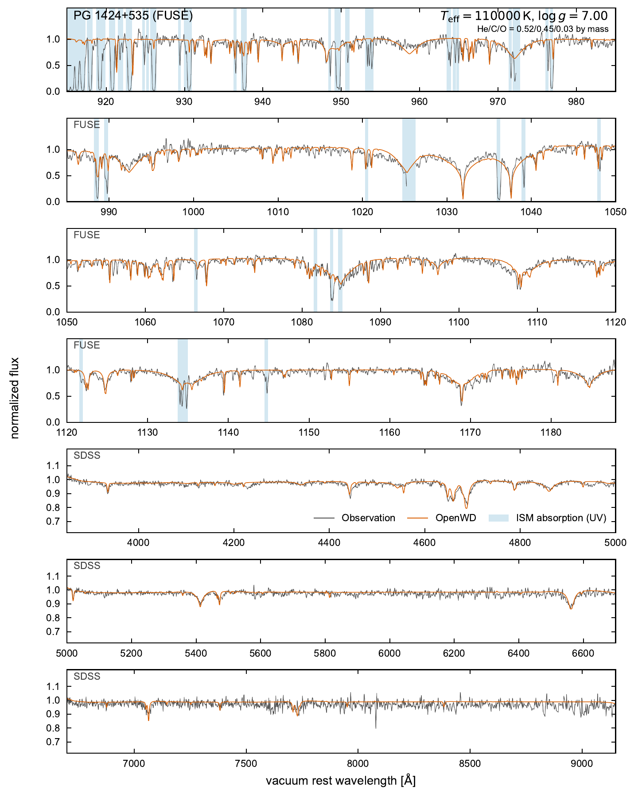

# PG 1159: homogeneous He/C/O NLTE atmospheres

[Model guide](README.md)

`PG1159Config` describes hot, hydrogen-deficient atmospheres dominated by
helium, carbon and oxygen. He, C and O are solved in NLTE for the atmospheric
structure; the trace elements in `mass_fractions` (N, Ne, F, Si, P, S, Ar, Fe)
are solved in NLTE on the finished structure for the line formation. The
atomic data are installed with OpenWD.

```python
from wd_spectra import PG1159Config, run_model

run = run_model(
    PG1159Config(effective_temperature=110000, logg=7,
                 mass_fractions={"He": 0.52, "C": 0.45, "O": 0.03},
                 refine_upper_atmosphere=True),
    "results/pg1159",
)
```

The same calculation from the command line:

```bash
python examples/one_shot_pg1159.py --teff 110000 --logg 7 \
  --refine-upper-atmosphere --output results/pg1159
```

Add `include_radiative_acceleration=True` (`--radiative-acceleration`) for the
hottest stars. Single-threaded cold starts of the three tested stars, with the
refinement, take 55–90 minutes.

A result is either `spectrum-qualified` or `converged`. `spectrum-qualified`
means it passed explicit flux, local heating, population, source and boundary
checks that protect the emergent spectrum; `converged` additionally requires
a full-rank temperature certificate. `run.convergence_verified` and
`require_convergence=True` accept only `converged`, so a spectrum-qualified
result is returned (with a warning) only without that flag. The status is in
`metadata.json` as `model_metadata["atmosphere_convergence_status"]`.

`compute_pg1159(config, wavelength, data=data)` returns the common
`ModelResult`, including the population state. Wavelengths are vacuum
Angstroms and the spectrum is surface `F_lambda` in
`erg s^-1 cm^-2 Angstrom^-1`. `save_model_result` writes the standard
atmosphere, spectrum, metadata, and diagnostic population files. The
implementation imports no research scripts and launches no subprocess.
The population result contains `structure`, `line_formation`, and
`line_formation_atmosphere`, so trace-population densities can be interpreted
with the corresponding electron and mass density. Final line formation must
pass its own undamped rate, electron-closure, and scattering-source checks;
a structural certificate alone does not qualify the returned spectrum.

The default stellar parameters and rounded published mass fractions are the
existing development PG 1424+535 preset. Mass fractions are normalized once;
they are not number ratios. Trace elements in the full default mixture enter
fixed-structure line formation. Their NLTE populations are passengers in the
He/C/O radiation field, and their opacity enters the final formal spectrum;
the private research switch for trace-opacity feedback is disabled in the
public model because these species do not define the atmosphere structure.
Only the normalized He/C/O mixture feeds back into the temperature structure.
Explicitly specify `mass_fractions` to request
a different mixture. Parameters are never fitted to an observation.

## Paper comparison: PG 1424+535

The paper compares FUSE far-ultraviolet and SDSS optical spectra with a model
at the fixed parameters of
[Werner et al. (2015)](https://doi.org/10.1051/0004-6361/201526842):
110000 K, log g = 7.0 and He/C/O = 0.52/0.45/0.03 by mass, with their
trace F, Ne, Si, P, S, Ar and Fe abundances. The complete rounded mixture is
the `PG1159Config` default. To retain those trace species, use
`PG1159Config(refine_upper_atmosphere=True)` without replacing
`mass_fractions`; the explicit three-element quick-start mixture above
contains only He, C and O.

[](../assets/pg1159-paper.pdf)

[Download the comparison (PDF)](../assets/pg1159-paper.pdf).
The atmosphere starts from a new gray structure and solves the He/C/O NLTE
populations and temperature together. The paper calculation includes the
upper-atmosphere local-energy refinement, followed by re-certification.
Trace species are then solved in NLTE on that structure and enter the final
spectrum. They do not supply structural blanketing. The plotted model is
**spectrum-qualified**, with the narrower certificate scope explained above;
it is not a full-rank temperature-equilibrium certificate.

Data and predictions are independently normalized using the same procedure
within each panel. FUSE data and model are smoothed to 0.1 Å FWHM, and the
optical prediction is convolved with the SDSS line-spread function. Fixed
wavelength corrections of -13.6 km/s (FUSE) and +14 km/s (SDSS) place the
observations on the displayed vacuum rest-frame scale. Geocoronal Ly-beta
and Ly-gamma emission is masked. Blue bands identify interstellar absorption
following Werner et al.; no interstellar opacity is added to OpenWD.

The calculation reproduces many He II, C III/C IV and O VI features across
both wavelength ranges. The O VI 1032/1038 Å wings and several optical
He II/C IV lines remain too deep. Their widths and the stellar parameters
were not adjusted to improve this figure. The comparison tests one star and
the selected model atom, rather than establishing a complete PG 1159 grid.

## Equations and convergence

The atmosphere adapter calls `solve_trust_region_newton`, the same central
nonlinear driver as the other OpenWD modules. Statistical equilibrium is
solved inside every material evaluation, and every proposed thermal step is
re-evaluated with the full transfer and rate equations before the shared
driver can accept it. Temporary Planck-blended continuation stages use the
PG-specific thermal response. At full NLTE, the module supplies the legacy
operator-split temperature correction as its proposal direction; the common
driver supplies trust limits, physical-domain recovery, merit backtracking,
termination, and diagnostics. This preserves the stable part of the
development solver without maintaining a second nonlinear driver.

The He/C/O population iteration uses the validated 80-state weighted-SVD
acceleration history away from the root and switches to the plain physical map
once the raw defect is within three times the requested target. A separate undamped rate-map
evaluation and electron-density rebuild check every returned material state.
Nonphysical trial populations and opacity states are recoverable trial
failures, so the common driver can shorten the step. Population-response
failures in an approximate continuation Jacobian are recorded and do not abort
an otherwise physical solve.

The temperature residual uses explicit NLTE emission and absorption,
`integral(kappa J - eta) d_lambda`, plus bolometric flux constancy. Transfer
and energy balance use the conservative column-mass cells, with electron
scattering solved directly. Population transfer uses that same discretization;
the public adapter uses joint population acceleration without the legacy
diagonal rate preconditioner. Research callers can still request that
preconditioner; it does not alter the converged rate equations.
The He/C/O EOS closes pressure and NLTE charge together. Its LTE reference
ion ratios are recomputed at that same electron density, so forward and
inverse rates use a consistent reference. Explicit ion-stage departures count
the LTE reservoir represented by each continuum parent with the same weights
as the rate solve. Population convergence uses a symmetric old/new scale plus
the configured physical floor, including for collapsing helium levels. The default retains the
accepted development benchmark's gas-pressure-only hydrostatics. Radiative
acceleration is recorded as a diagnostic. The option
`include_radiative_acceleration=True` adds it to hydrostatic balance; a trial
requiring nonpositive gas pressure is inadmissible and the force is never capped.
For PG 1159-035 the radiative acceleration reaches 0.28 g and the option
lowers the density by 14-21% at `tau_Ross` 0.03-1; a cold start with it and
the upper-atmosphere refinement certifies (see below).
Gas-pressure-only convergence does not establish hydrostatic consistency where
the diagnostic radiative acceleration is substantial.

A public call begins with the requested star's own continuum atmosphere and
does not load a saved atmosphere, population checkpoint, or legacy temperature
shape.
Four inexpensive gray-temperature updates use the requested He/C/O opacity
to precondition that seed. They preserve Teff, gravity, composition and the
hydrostatic pressure/mass grid; no stored atmosphere is used. This sparse
opacity quadrature only prepares the seed, and does not certify equilibrium.
An internal local-Planck stage initializes the temperature at fixed gravity-supported
pressure. One 50%-NLTE bridge initializes the coupled populations without
changing the temperature. The next stage solves the exact full-NLTE equations
with the legacy operator-split map inside the shared driver. It uses a 1%
material target while relaxing the structure, then a separate certification
evaluation independently checks that same configured 1% target. This avoids the
old 90/95/98-percent ladder and avoids solving temporary departure equations
as complete atmospheres. With `include_radiative_acceleration=True`, the
radiative force is introduced with the half-NLTE bridge and reaches full
strength in the relaxation stage. No saved atmosphere is discovered or loaded.
The Planck and half-NLTE stages are recorded as initialization handoffs, with
nonlinear convergence false; stationary roots of those temporary equations
are not required.

The `pg1159-spectrum-gate-v1` certificate profile requires the bolometric
surface flux, the internal flux throughout `tau_Ross < 10`, and the flux over
the complete grid through `tau_Ross = 100` to agree with `sigma Teff^4` within
1%. Local heating over `1e-5 <= tau_Ross < 10` must agree within 0.3%. The
shallower cells are excluded because the cancellation-prone local heating
ratio is set by the numerical surface boundary there: in the PG 1159-035 cold
diagnostic the first included cell was at 1.02%, while the adjacent excluded
cell was 6.02% and deeper cells were below 0.2%. The maximum excluded-surface
imbalance remains recorded as a diagnostic.
Scattering-source closure must be below `1e-6`, the
lower-boundary escape bound below 1%, and hydrostatic and electron closures
must pass their stage tolerances. Temperature stationarity is retained as a
diagnostic but is not a gate: the unrestricted frozen-population correction is
ill-conditioned in deep and weakly coupled cells and was silently waived by
the development solver as well. A passing profile is reported as
`spectrum-qualified`, never `converged`; the latter remains reserved for the
default equilibrium certificate with measured stationarity. The declared
residual windows and tolerances are recorded in the output certificate.

### Optional upper-atmosphere refinement

`PG1159Config(refine_upper_atmosphere=True)` (default `False`) adds two stages
after certification. The Newton stages start from the gray seed and leave the
layers above `tau_Ross ~ 1e-3` near its surface temperature: their local
heating is balanced to well inside the 0.3% gate, but it barely depends on
temperature there, so the flux rows do not move them. The refinement converges
those layers to local radiative equilibrium with a TMAP-style hybrid
iteration: at each temperature the populations are closed by plain Lambda
iteration to `1e-3`; cells above `tau_Ross = 1e-2` take a local step from the
measured per-cell secant of the relative heating, deeper cells an
Unsöld-Lucy flux step. Steps are capped at 20% in `T`, halved when a cell
reverses direction, and the first step is a 2% probe. While the last step
exceeds 3% the populations are closed only to `3e-3`. The stage stops, at the
fine closure, when the certificate gates pass and either every step is below
1% or every band cell's relative heating is below `6e-4` with every step
below 3%. The refinement holds the pressure structure fixed; with
`include_radiative_acceleration=True` the radiation pressure enters the
coupled Newton re-certification that follows. (A pressure update inside the
refinement, `options["include_radiative_acceleration"]`, is experimental and
did not converge.) The re-certification accepts a proposal-limited final
step because its convergence test checks every certificate gate directly. It uses a 17-point line-core velocity
stencil, because the structural preset's 9 samples resolve the oxygen thermal
core with three points and bias the outermost energy balance by up to 1.5%.
The refined structure is then certified again on those equations, and the
returned certificate belongs to them.

On the three validation stars the refined structures are monotonic, falling
to about 0.5-0.6 `Teff` at the top. With the current defaults, single-threaded
cold starts with the refinement certify in 54 (PG 1707+427), 74 (PG 1424+535)
and 90 minutes (PG 1159-035, with radiative acceleration). The effect on the
spectra is mostly positive. For PG 1424+535 the FUSE O VI 1032/1038 profile
loses its emission horns and gains V-shaped cores, and the spurious C IV 5801
emission disappears, but several optical C IV and He II absorption lines become
too deep. PG 1707+427 is nearly unchanged. For PG 1159-035 the O VI 1032/1038
cores improve and the spurious O V emission at 6001 and 6380-6500 A
disappears; C IV 5801 emission becomes too strong and He II 4686 stays too
deep. In the refined upper layers (`tau_Ross` 1e-5-1e-2) 95-99% of the
radiative heating and cooling is in lines and the net balance is ~1e-4 of the
gross terms: photoionization of excited C IV levels heats, C IV and He II
lines cool, and electron collisions barely matter (doubling the C, O or He II
collision rates moves `T` by < 1%). In PG 1159-035 local radiative
equilibrium is thermally unstable between `tau_Ross` 2e-5 and 4e-4. The
option remains opt-in.

Hot NLTE metal-line profiles (`light_metal_nlte`) are truncated at 10% of the
line's central wavelength. Without this bound the Stark-broadened high-Rydberg
Delta-n=1 lines of O IV-O VI (FWHM up to ~1e4 A at 2-6 micron) extend their
Lorentz wings across the whole spectrum and act as a spurious pseudo-continuum.
The LTE metal-line path is not bounded. When a full-NLTE Newton step is
rejected, the material closure is tightened from 1% to 0.1% (and, if needed,
resolved to `1e-4`) before the step is retried; this is what lets the
PG 1159-035 cold start certify.

The default structural and formal-population target is 1%. The expanded formal
atom develops a numerical floor near 0.6%, so tighter targets can spend many
minutes moving weak populations without improving the spectrum. On the cold
PG 1424+535 validation model, tightening the structural target from 1% to 0.5%
increased structure time from 522 to 1046 seconds. The resulting
continuum-normalized 3800--7000 Angstrom spectra differed by `3.3e-4` RMS,
`6.0e-6` median, and `1.0e-4` at the 95th percentile; the largest difference
was `4.2e-3` in the 4688 Angstrom line core. The 1% cold spectrum agrees with
the legacy spectrum over their common 3800--6100 Angstrom coverage to
`6.5e-3` RMS and `9.2e-3` at the 95th percentile after normalization at
5500 Angstrom. A separate cold-origin continuation reached 0.651% all-depth
flux error and 0.162% local heating error; its coarse normalized optical
spectrum differed from the legacy-shape public result by 0.49% RMS. These
measured spectral changes, rather than an unreachable inner tolerance, set the
supported spectrum-qualification point. Iteration-budget exhaustion and any
failed required profile check remain explicitly unconverged.

`quick` checks the interface and is not a convergence claim. Standard uses 40
depths with the validated 120-point continuum and two-angle structure
quadrature. Production uses 80 depths, 300 continuum points, and three angles
for resolution studies. PG1159 structures span `1e-8 <= tau_Ross <= 100`,
matching the legacy validated domain; deeper layers do not contribute to the
emergent spectrum. Standard cold starts with the upper-atmosphere refinement
took 54 (PG 1707+427), 74 (PG 1424+535) and 90 minutes (PG 1159-035, with
radiative acceleration) single-threaded, including the trace-element line
formation. The actual grid and convergence values are recorded in the result. An
independent depth/frequency grid study and a broad observational qualification
remain necessary.

The optional `_rt` C extension accelerates Gaunt-table interpolation,
bound-free opacity accumulation, photoionization integration, and the positive
rate-system elimination. The Python routines remain available as numerical
references and fallbacks. These kernels preserve the rate equations, stellar
parameters, and convergence thresholds; shorter kernel timings alone do not
establish atmosphere convergence or a total model runtime.

## Atomic data

The model preserves the accepted development choices: 14 He I terms and
14 He II shells; 97/54/1 explicit C III/IV/V terms; and
47/83/105/54/1 O III/IV/V/VI/VII terms for `extended54-complete`. The
`compact14` option retains 14 O VI terms instead. The He II collision model
retains the development CCC prescription through shell 8 and the TLUSTY/Mihalas
fallback above it; both choices are recorded in the result. The larger atom includes
resolved TOPbase/OP bound-free data, CHIANTI collisions, and PSM20/BTM
angular-momentum mixing. Bound-bound rates integrate the thermodynamic inverse over the same profile
as absorption, and the statistical-equilibrium solve uses positive rate
elimination to retain weak links. These changes restore the local-Planck
LTE limit of the full atom. The TMAD formal-level mapping preserves term and
principal-quantum-number identity. A population term takes formal levels
whose labels agree in n, multiplicity and L; when none exists it may fall back
only to formal levels whose labels carry no comparable field, never to a level
that contradicts it, and otherwise stays unmapped. (A former fallback to any
remaining level let near-degenerate high-n O V, O IV, O VI and C III terms
borrow unrelated levels, e.g. O V 2s6p components for the absent 2s6s 3S term.)
The same rule applies to the two other label matches: the import of the TMAD
O III-VII synthesis atoms onto the Stout levels, where a TMAD level with no
compatible Stout level is appended as its own level (O V 2s6s 3S, for
example), and the assignment of formal levels to LTE-parent terms.
`formal_lte_term_labels` on the TMAD structure atom records the LTE term behind
each LTE-parent assignment. The multiplicity of a TMAD fine-structure key is the
digit after its J field (`O507H 51HO` is 7h J=5 1Ho). Reading it lets the match
separate near-degenerate singlet and triplet levels of equal J; before, they
could swap, which moved O V 4500 and 6001 A onto triplet upper levels and made
them spurious emission lines in PG 1159-035. Every parseable O III-VII formal
line with f >= 0.01 now obeys the LS dipole selection rules (a test checks this).

TMAD formula-4 lines (C IV and O VI high-n transitions) carry a quasi-static
linear-Stark wing in addition to the impact profile. TMAP's formula spreads
the whole `n_l -> n_u` line with one Holtsmark distribution at the frequency
scale of the outermost Stark component, `X_max = n_u(n_u-1) + n_l(n_l-1)` in
units of `3 e a0 F / 2Z`. The PG1159 model instead uses the hydrogenic
component pattern (`_hydrogenic_stark`): shifts `X = n_u(n1-n2)_u -
n_l(n1-n2)_l` and strengths from parabolic-state dipole matrix elements, with
one Holtsmark distribution per component at the same microfield. The
implementation reproduces the Lyman-alpha and Balmer-alpha patterns of Bethe
& Salpeter (1957). For Delta-n=1 lines most of the strength is in small shifts:
the far wing of O VI 7-8 (5290 A) is 0.013 and that of C IV 4-9 0.27 of the
formula-4 value. No ion- or series-specific wing scale is applied
(`PG1159_STATIC_LINEAR_STARK_FREQUENCY_SCALES` is empty); this replaces the
former development factor 0.25 for C IV 4-9, and removes the broad formula-4
trough around O VI 5290 in PG 1159-035 (UVES chi2 0.80 to 0.42; TMAP 0.40).
The hydrogenic pattern is an upper limit where low-`l` quantum defects exceed
the Stark splitting. Tabulated electron-impact widths (C IV 1548/1551 and
5801/5812, O V 3p-3d, O VI 1032/1038 and 3811/3834) apply only to the
multiplet's own components and the rate-atom term centroid (within 0.1 A),
not to unrelated high-n lines inside the same wavelength window. The O VI
1032/1038 damping wings remain too deep in PG 1424+535 and PG 1159-035 at the
Dimitrijevic & Sahal-Brechot / Elabidi et al. width; the data prefer a width
about four times smaller (the TMAD Cowley value), which is not adopted.

OpenWD installs the following inputs in its runtime `cache/` tree:

- `helium-stark/Tremblay26.txt` and `helium-stark/he2prf.dat`;
- `ccc/e-H_XSEC_LS.zip`, `tlusty-source/tlusty200.f`, and
  `tlusty-atoms/he1_14lev.dat`;
- `metal-opacity/atomic-line-list/stout/` and
  `metal-opacity/verner-photoionization.dat`;
- `tlusty-atoms/c3.dat`, `c4_35+2lev.dat`, `o4.dat`, `o5.dat`, and `o6.dat`;
- `tmad-atoms/C_III-V`, `O_III-VII`, `C_IV_syn`, and
  `O_III_syn` through `O_VII_syn`;
- for the extended O VI atom, `sirocco-atomic/o_6_levels.dat`,
  `sirocco-atomic/o_6_phot.dat`, and `chianti/o_6/o_6.scups`.

No separate atomic-data download is needed for the default model. A complete
custom `ModelData`/`OPENWD_DATA` tree may override the installed data; the
adapter reports every missing path before starting. It records the selected
atomic-file hashes and actual model-atom counts in the output. See
`THIRD_PARTY_NOTICES.md` for attribution and redistribution terms.

## Scope

The atmosphere is static, plane parallel, and homogeneous. Winds, spherical
extension, diffusion/stratification, and full iron-group NLTE blanketing are
not implemented. Trace-element line formation does not validate their
structural feedback. A numerical equilibrium certificate refers to the
implemented equations on their declared grid, not complete physical accuracy
or agreement with every observed PG 1159 spectrum.
