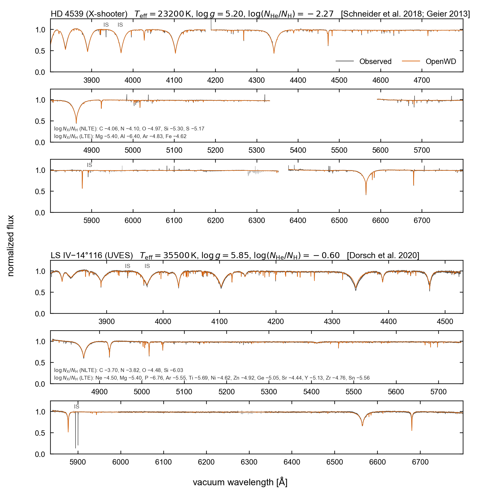

# sdB: hot-subdwarf hybrid LTE/NLTE models

[Model guide](README.md) · [Solver development record](../development/sdb-hybrid.md)

OpenWD includes an experimental workflow for hot subdwarf B stars: lower-gravity
hydrogen–helium atmospheres with optional trace metals. It uses an LTE H/He
temperature structure, followed by NLTE populations and line formation on that
fixed structure. The research drivers are included in the repository; there is
currently no `SdBConfig` or sdB selection through `run_model`.

The development grid spans 20,000–40,000 K, log g = 5.0–6.2 and
log10 N(He)/N(H) = −4 to −1 at 40 depths. The paper also compares an
intermediate helium-rich sdOB star. These are tested examples, rather than a
qualification of the whole parameter range.

## Paper comparison

[](../assets/sdb-paper.pdf)

[Download the paper figure (PDF)](../assets/sdb-paper.pdf).

Gray is the observed optical spectrum; orange is OpenWD. The top three panels
show helium-poor HD 4539 (ESO X-shooter co-add); the bottom three show the
intermediate helium-rich sdOB LS IV−14°116 (the UVES co-add of Dorsch et al.
2020). Temperatures, gravities, helium fractions and metal abundances are fixed
at published values; no stellar parameters or abundances were fitted here.

| Object | Teff (K) | log g | log10 N(He)/N(H) | Adopted inputs |
| --- | ---: | ---: | ---: | --- |
| HD 4539 | 23,200 | 5.20 | −2.27 | [Schneider et al. (2018)](https://doi.org/10.1051/0004-6361/201833182) H/He parameters; [Geier (2013)](https://doi.org/10.1051/0004-6361/201220549) metal abundances |
| LS IV−14°116 | 35,500 | 5.85 | −0.60 | [Dorsch et al. (2020)](https://doi.org/10.1051/0004-6361/202038859) parameters, abundances and v sin i = 9 km/s |

The predictions are convolved to the instrument resolution: X-shooter
R = 9,861/18,340 and UVES R = 40,970/42,310. LS IV−14°116 also includes
rotational broadening. Observations and models are normalized independently
with the same broad upper-envelope procedure, within each contiguous segment.
The figure compares line profiles, rather than absolute flux calibration.

Wavelengths are vacuum Angstroms. HD 4539 is shown in the observed frame with a
fixed −3 km/s model shift; LS IV−14°116 is in its stellar rest frame. Light gray
marks telluric bands; “IS” marks interstellar Ca II and Na D, which the stellar
model does not include. Gaps are masked or missing data, including the
X-shooter UVB/VIS junction. The PDF and preview are copies of the manuscript
assets, with checksums in the [figure manifest](../assets/paper-figures.json).

HD 4539's Balmer and He I line-core depths agree within about 0.02 of normalized
flux, with an RMS residual of 0.010 over the plotted range. LS IV−14°116 shows
the main H/He and metal features, including the heavy-element lines, but its
blue H/He cores remain 0.03–0.07 shallower than observed and red He I cores
about 0.02 deeper. Numerical convergence does not remove these discrepancies.

## Physical method

1. **Fresh LTE H/He structure.** `sdb_lte_hhe.py` calls the DAB module at the
   requested temperature, gravity and H/He ratio. The default structure contains
   no metals.
2. **NLTE H/He on the fixed structure.** `sdb_hybrid_nlte.py` holds the
   temperature and gas-pressure profiles fixed, with an LTE H/He charge closure.
   The paper models use 16 explicit H I levels, the 14-term He I atom and
   multilevel accelerated lambda iteration (MALI). Helium conservation replaces
   the equation of the most populous helium state, which avoids loss of
   precision when He III is a trace ion. A 24-term He I atom is optional.
3. **Trace-metal line formation.** `sdb_trace_metals.py` holds the H/He host and
   populations fixed while solving C, N, O, Si and S in NLTE. Other requested
   elements enter as LTE line opacity. The paper comparison also uses LTE
   supplementary N II lines and Ge, Sr, Y, Zr and Sn lines from Kurucz and the
   literature, through `sdb_heavy_lines.py`.

The metal solver accounts for overlapping lines in its MALI preconditioner,
using the research driver's default 15 km/s overlap window and `subordinate`
mode. Metal opacity enters the line formation, but does not relax the default
H/He temperature structure. This hybrid method differs from the fully coupled
[DO/DAO atmosphere solver](DO-DAO.md), which does not currently converge reliably
at sdB densities.

## Run an example

From a repository checkout, install the package and optional observation tools:

```bash
python -m pip install -e '.[validation]'
export OMP_NUM_THREADS=1 OPENBLAS_NUM_THREADS=1
```

Start a fresh HD 4539 H/He model, then calculate its hybrid NLTE spectrum:

```bash
python research/sdb_lte_hhe.py --teff 23200 --logg 5.20 --log-he-h -2.27 \
    --output results/sdb/example-hd4539-lte
python research/sdb_hybrid_nlte.py results/sdb/example-hd4539-lte \
    --hydrogen-levels 16 --accelerated-lambda \
    --population-iterations 200 200 200 \
    --output results/sdb/example-hd4539-hybrid
```

Add the principal metals at the adopted HD 4539 abundances:

```bash
python research/sdb_trace_metals.py results/sdb/example-hd4539-lte \
    results/sdb/example-hd4539-hybrid \
    --abundance C=-4.06 --abundance N=-4.10 --abundance O=-4.97 \
    --abundance Si=-5.30 --abundance S=-5.17 \
    --lte-abundance Mg=-5.40 --lte-abundance Al=-6.40 \
    --lte-abundance Ar=-4.83 --lte-abundance Fe=-4.62 \
    --output results/sdb/example-hd4539-metals
```

Use a new output directory for each stage. `--log-he-h` means log10 N(He)/N(H);
this is the opposite sign to `DABConfig.log_hydrogen_to_helium`. Every metal
abundance above is log10 N(element)/N(H).

Each stage writes `spectrum.npz` and `run-summary.json`. Spectra contain
`wavelength_vacuum` and surface `flux` in erg s⁻¹ cm⁻² Å⁻¹. The hybrid stage
also writes `spectrum-lte.npz` with the same synthesis and LTE populations,
so the NLTE effect can be compared directly. Inspect
`atmosphere_convergence_status` in the LTE summary, `populations_converged`
in the hybrid summary and `converged` in the metal summary before using a result;
these research scripts can save outputs even when a solve has not converged.

The [development record](../development/sdb-hybrid.md) describes the grid checks,
fixed-point verification and metal comparisons. The repository also includes
`research/sdb_paper_models.sh`, `research/plot_sdb_paper_comparison.py` and
`research/plot_sdb_line_atlas.py` for the paper models and displays. Observational
co-adds are separate inputs; they are not needed to compute a synthetic spectrum.

## Validation and limitations

The 12-point H/He development grid converged at 40 depths in 9–21 minutes per
model on one core; one further unpreconditioned update changed the populations
by at most 9 × 10⁻⁵. A typical-metal grid on those hosts converged in 35–73
iterations (6–10 minutes). The paper's HD 4539 and LS IV−14°116 metal solves
converged in 42 and 41 iterations. These timings are development measurements,
not runtime guarantees or whole-grid accuracy tests.

- The default LTE structure is metal-free. Metal line blanketing can alter the
  structure; an exploratory helium-poor Feige 38 test changed temperatures by
  1.6–2.4%. The default metal solve does not feed back into the energy balance.
- Radiation pressure and vertical abundance stratification are omitted. Hot
  sdO stars above about 40,000 K remain outside this workflow's tested scope.
- He I profiles assume ⁴He; observed ³He isotope shifts are not included.
- High-level atomic closures and approximate collision rates remain sources
  of uncertainty. Supplementary heavy-element and N II lines use LTE populations.
- The development runs use 40 depths. The cost and accuracy of production
  depth resolution have not been established across the grid.

See the [third-party notices](../../THIRD_PARTY_NOTICES.md) for the atomic-data
sources and attribution. The figure is an archived paper snapshot, rather than
a new qualification of every sdB model under the current source tree.
